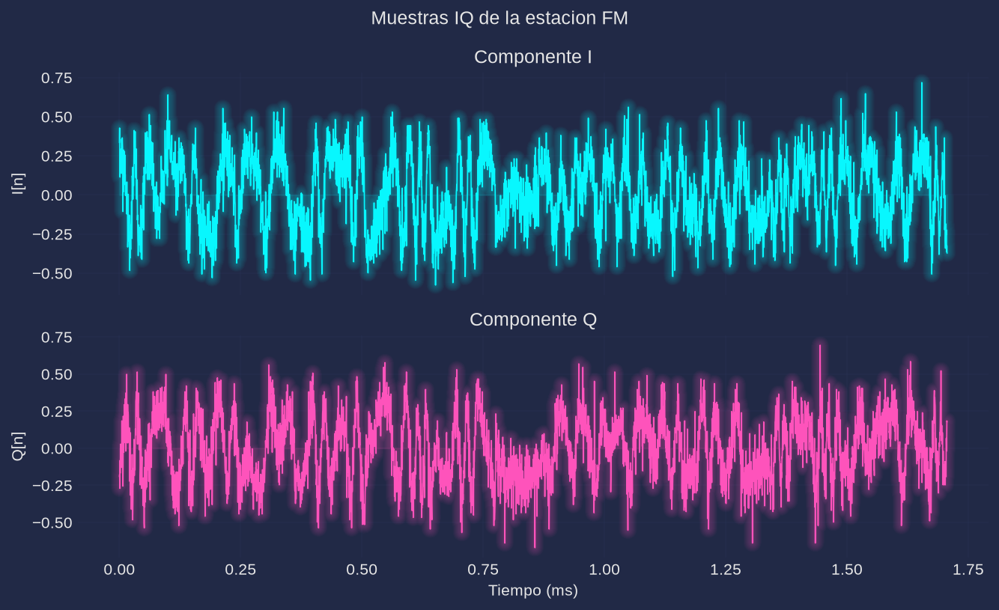
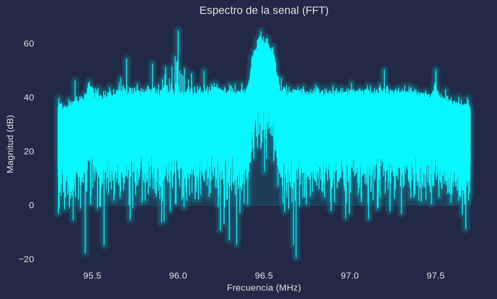
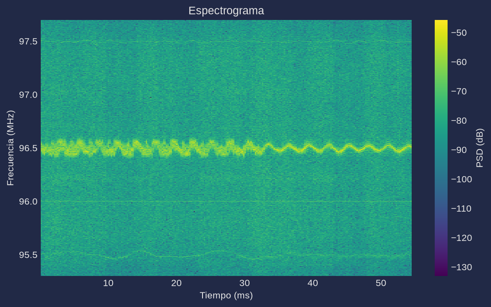

# Práctica 1. Introducción al RTL-SDR y análisis espectral de señales inalámbricas

**Materia:** Comunicaciones Inalámbricas
**Equipo:** RTL-SDR (`RTL2832U` + tuner `R820T`), antena telescópica
**Script:** [`practica1.py`](practica1.py) (Python; en este repo el análisis se hace en Python en lugar de MATLAB)

---

## 1. Objetivo

Configurar el receptor RTL-SDR, adquirir muestras IQ de una estación FM comercial y analizarlas en el tiempo y en la frecuencia: componentes I/Q, potencia recibida, espectro (FFT), espectrograma, frecuencia central y ancho de banda observados.

## 2. Fundamento teórico

El receptor entrega la envolvente compleja de la señal de RF muestreada:

$$x[n] = I[n] + jQ[n]$$

donde $I[n]$ es la componente en fase (proyección sobre $\cos(2\pi f_c t)$) y $Q[n]$ la componente en cuadratura (proyección sobre $-\sin(2\pi f_c t)$). La información de amplitud y fase está en $|x[n]|$ y $\angle x[n]$.

El análisis espectral se obtiene con la DFT:

$$X[k] = \sum_{n=0}^{N-1} x[n]\,e^{-j2\pi kn/N}, \qquad f_k = -\frac{F_s}{2} + k\frac{F_s}{N}$$

La potencia promedio recibida se estima como

$$P = \frac{1}{N}\sum_{n=0}^{N-1}|x[n]|^2, \qquad P_{dB} = 10\log_{10}(P)$$

Para una señal FM, el ancho de banda teórico (Carson) es $B \approx 2(\Delta f + f_m)$, que para radiodifusión ($\Delta f = 75$ kHz, $f_m = 15$ kHz) da ≈ 180 kHz; el canal comercial se espacia cada 200 kHz.

## 3. Desarrollo experimental

### 3.1 Verificación del dispositivo

`comun.info_dispositivo()` (equivalente a `sdrinfo('RTL-SDR')`) reporta:

| Parámetro | Valor |
|---|---|
| Chip | RTL2832U |
| Tuner | R820T |
| Rango de sintonía | 24 – 1766 MHz |
| Ganancias disponibles | 29 valores, 0.0 – 49.6 dB |
| Sample rate configurado | 2.4 MSPS |

### 3.2 Configuración del receptor

| Parámetro | Valor |
|---|---|
| Frecuencia central | **96.5 MHz** (estación FM más fuerte del sitio; 100.5 MHz del manual no tiene emisora en esta ubicación) |
| Sample rate | 2.4 MHz |
| Muestras capturadas | 131 072 (≈ 54.6 ms) |
| Filtro IF del tuner | 2.4 MHz (span completo) |
| Ganancia | fija calibrada (la mayor sin recorte de ADC: 49.6 dB) |

> Nota técnica: en este dongle el AGC del R820T satura el ADC (RMS ≈ 0.9 con 31 % de muestras recortadas), por lo que el script usa una ganancia fija calibrada. La captura es asíncrona para no perder muestras.

### 3.3 Procedimiento

1. `python3 practica1.py` captura las muestras IQ y las guarda en `datos/iq.npy`.
2. Se calculan potencia, FFT y espectrograma.
3. Se estiman la frecuencia central (centroide del 99 % de la potencia en exceso sobre el piso de ruido) y el ancho de banda ocupado.
4. Se generan las figuras en `figs/`.

## 4. Código

El script completo está en [`practica1.py`](practica1.py). Fragmentos esenciales:

```python
x = comun.capturar(96.5e6, n=131072, rate=2.4e6, ganancia="auto", bw=2.4e6)  # [data,len] = rx()
P_dbfs = 10*np.log10(np.mean(np.abs(x)**2))                                   # P = mean(abs(data).^2)
X = np.fft.fftshift(np.fft.fft(x))                                            # X = fftshift(fft(data))
f = np.linspace(-Fs/2, Fs/2, x.size)                                          # f = linspace(-Fs/2,Fs/2,N)
f, t, S = sig.spectrogram(x, fs=Fs, window="hamming", nperseg=1024,
                          noverlap=512, nfft=1024, return_onesided=False)     # spectrogram(...,'centered')
```

## 5. Resultados

### 5.1 Mediciones

| Parámetro | Valor |
|---|---|
| Frecuencia sintonizada | 96.500 MHz |
| Muestras | 131 072 |
| Potencia promedio recibida | **−10.18 dBFS** |
| Frecuencia central observada | **96.4934 MHz** (offset −6.6 kHz) |
| Ancho de banda ocupado (99 % de potencia) | **147.7 kHz** |

### 5.2 Componentes I y Q



Las componentes I y Q oscilan alrededor de cero con amplitud similar; su evolución conjunta es la envolvente compleja de la estación. El ruido térmico del receptor se aprecia como fluctuación rápida superpuesta.

### 5.3 Espectro (FFT)



Se observa el "hump" de la señal FM centrado en 96.5 MHz, con un ancho de aproximadamente 150–200 kHz, sobre un piso de ruido aproximadamente 15–20 dB más abajo.

### 5.4 Espectrograma



La emisión se mantiene estable durante toda la captura (54.6 ms): no hay saltos de frecuencia ni ráfagas; la energía se concentra en la banda de la estación.

## 6. Análisis de resultados

- La potencia medida (−10.2 dBFS) es alta porque la escala del RTL-SDR es relativa a fondo de escala del ADC; no es una potencia absoluta en dBm. Para comparar con un modelo de propagación habría que calibrar el receptor.
- La frecuencia central observada difiere en −6.6 kHz de la sintonizada. Es un error relativo de ≈ 68 ppm, atribuible al oscilador de cristal del dongle (los RTL-SDR sin TCXO tienen errores típicos de decenas de ppm). Se corrige con `--ppm`.
- El ancho de banda estimado (147.7 kHz, 99 % de potencia) es menor que el valor teórico de Carson (≈ 180 kHz) porque las "colas" del espectro FM quedan por debajo del piso de ruido con la antena disponible (relación portadora/ruido ≈ 15–20 dB). El canal comercial completo (200 kHz) es el valor de diseño.
- El espectrograma confirma que la señal es estacionaria en la ventana analizada y que el receptor no presenta saltos de sintonía.

## 7. Cuestionario

1. **¿Qué representan las componentes I y Q?**
   Son las proyecciones de la señal de RF sobre dos portadoras en cuadratura ($\cos$ y $-\sin$). Juntas forman la envolvente compleja $x = I + jQ$, que conserva la amplitud $|x|$ y la fase $\angle x$ de la señal.
2. **¿Por qué se utilizan muestras complejas?**
   Porque representan señales de banda base con espectro asimétrico (FM, PM, SSB) sin ambigüedad, conservan el signo de la frecuencia y permiten demodular fase/frecuencia. Con muestras reales se perdería la fase y aparecerían imágenes espectrales.
3. **¿Qué información proporciona la FFT?**
   La distribución de la potencia/amplitud de la señal en función de la frecuencia: ubicación de la portadora, ancho de banda ocupado, presencia de armónicos, interferencias y la relación señal a ruido.
4. **¿Qué diferencias observa entre el dominio temporal y frecuencial?**
   En tiempo se ve la forma de onda (variaciones de I/Q y de la envolvente) pero no se distingue qué componentes espectrales la forman; en frecuencia se ve qué componentes están presentes y con qué potencia. Ambos dominios contienen la misma información (transformada), pero cada uno resalta fenómenos distintos: transitorios en tiempo, contenido espectral en frecuencia.
5. **¿Por qué es útil el espectrograma?**
   Porque muestra la evolución del contenido espectral en el tiempo (representación tiempo–frecuencia), lo que permite detectar señales no estacionarias, interferencias intermitentes, saltos de frecuencia y verificar la estabilidad de la emisión.

## 8. Conclusiones

Se configuró el RTL-SDR y se caracterizó una estación FM real en 96.5 MHz. La captura de 131 072 muestras IQ permitió obtener las componentes I/Q, un espectro con la emisora claramente identificable y su espectrograma. La potencia promedio fue −10.18 dBFS, la frecuencia central observada 96.4934 MHz (error de −6.6 kHz por el oscilador del dongle) y el ancho de banda ocupado 147.7 kHz al 99 % de potencia, consistente con una emisión FM comercial de 200 kHz de canal. El procedimiento queda reproducible con `python3 practica1.py` (y verificable sin hardware con `--sim`).
