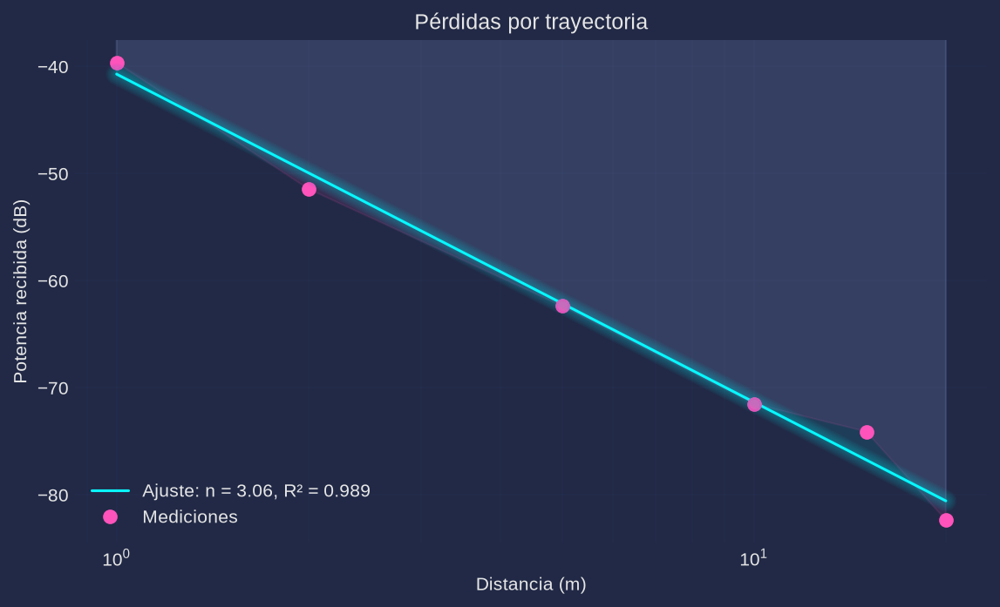
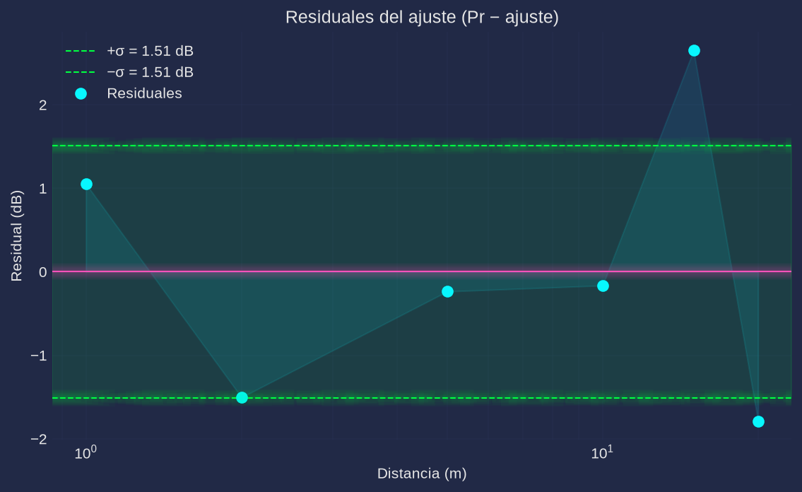

# Práctica 2. Medición experimental de pérdidas por trayectoria (path loss)

**Materia:** Comunicaciones Inalámbricas
**Equipo:** RTL-SDR (`RTL2832U` + tuner `R820T`), antena telescópica; transmisor LoRa/ISM a 433.9 MHz (pendiente de entrega)
**Script:** [`practica2.py`](practica2.py) (Python; en este repo el análisis se hace en Python en lugar de MATLAB)

---

## 1. Objetivo

Caracterizar experimentalmente la atenuación de una señal inalámbrica en función de la distancia entre transmisor y receptor, estimando por mínimos cuadrados el exponente de pérdidas $n$ del modelo logarítmico de propagación para el entorno analizado, y compararlo con los valores típicos reportados en la literatura.

## 2. Fundamento teórico

La potencia recibida a una distancia $d$ se modela con el **modelo logarítmico de pérdidas por trayectoria**:

$$PL(d)\,[\text{dB}] = PL(d_0) + 10\,n\,\log_{10}\!\left(\frac{d}{d_0}\right) + X_\sigma$$

o, en términos de potencia recibida con referencia a 1 m ($P_0 = P(1\,\text{m})$):

$$P(d)\,[\text{dB}] = P_0 - 10\,n\,\log_{10}(d) + X_\sigma$$

donde $n$ es el exponente de pérdidas y $X_\sigma \sim \mathcal{N}(0, \sigma^2)$ es el *shadowing* log-normal (fluctuaciones lentas por obstáculos). Valores típicos:

| Entorno | $n$ |
|---|---|
| Espacio libre | 2.0 |
| Exterior urbano | 2.7 – 3.5 |
| Interior oficinas | 3.0 – 5.0 |
| Interior con obstáculos | 4.0 – 6.0 |

La potencia de cada bloque IQ se estima como $P(k)=\frac{1}{N}\sum_{i=0}^{N-1}|x[i]|^2$ y el nivel en dB como $P_{dB}=10\log_{10}\!\left(\overline{P}\right)$.

El ajuste por mínimos cuadrados de $P_{dB}$ contra $x=\log_{10}(d)$ es una recta $P_{dB}\approx a\,x+b$, de modo que

$$n = -\frac{a}{10}, \qquad b = P_0 \text{ (intercepto en } d_0=1\,\text{m}), \qquad
R^2 = 1-\frac{\sum r_i^2}{\sum (P_i-\bar P)^2}$$

## 3. Desarrollo experimental

### 3.1 Configuración del receptor

| Parámetro | Valor |
|---|---|
| Frecuencia central | **433.9 MHz** (banda ISM, frecuencia del nodo transmisor) |
| Sample rate | **2.4 MHz** |
| Muestras por bloque | **4096** (`--frame`) |
| Bloques por distancia | **10** (`--nmed`) |
| Ganancias | **auto calibrada**: mayor ganancia del R820T sin recorte del ADC (`comun.fijar_ganancia`) |
| Distancias | **1, 2, 5, 10, 15 y 20 m** |
| Captura | asíncrona (`comun.capturar`), sin pérdida de muestras |

### 3.2 Procedimiento

1. Conectar el RTL-SDR a la PC y el transmisor LoRa a una fuente estable; fijar el transmisor en una posición y altura constantes.
2. Ejecutar `python3 practica2.py -f 433.9e6`. Para cada distancia el script pide confirmar con `input()` que el transmisor está colocado a esa distancia.
3. En cada punto se capturan **10 bloques de 4096 muestras**; por bloque se calcula $P(k)=\text{mean}(|x|^2)$ y la potencia del punto es $P_{dB}=10\log_{10}\!\left(\text{mean}(P(k))\right)$.
4. Las mediciones se guardan en `datos/mediciones.csv` y el ajuste en `datos/resultados.json`.
5. El script ajusta la recta, calcula $n$, $R^2$ y los residuales, y genera `figs/pathloss.png` y `figs/residuales.png`.
6. Entorno de medición previsto: **pasillo del edificio E17-A** (interior con obstáculos), manteniendo visibilidad directa hacia el transmisor, misma orientación de antenas y sin tránsito de personas durante la captura.

> El dongle físico puede estar ocupado; la verificación del script se realizó con `--sim` y `--selftest`, que corren el mismo pipeline de ajuste sin hardware.

## 4. Código

El script completo está en [`practica2.py`](practica2.py). Fragmentos esenciales:

```python
# Adquisición real: P(k) = mean(|data|^2) por bloque
for i, d in enumerate(distancias):                 # d = [1 2 5 10 15 20]
    input(f"Transmisor a {d:g} m — Enter para capturar...")
    for k in range(nmed):                          # Nmed = 10
        x = comun.capturar(freq, n=frame, ganancia=gain)   # [data,len] = rx()
        P[i, k] = np.mean(np.abs(x) ** 2)

# Simulación log-normal: Pr(d) = P0 - 10*n*log10(d) + X_sigma
return p0 - 10.0 * n_real * np.log10(d)[:, None] + rng.normal(0, sigma, (d.size, nmed))

# Ajuste por mínimos cuadrados (equivalente a p = polyfit(log10(d), Pr, 1))
x = np.log10(d)
p = np.polyfit(x, Pr_dB, 1)                        # p = [pendiente, intercepto]
n = -p[0] / 10.0                                   # n = -p(1)/10
```

## 5. Resultados

> **Los valores de esta sección provienen de la corrida de verificación por simulación (`python3 practica2.py --sim --no-show`), con $P_0=-40$ dB a 1 m, $n_{real}=3.2$ y $\sigma=4$ dB. Son datos sintéticos de verificación y se reemplazarán por los de la corrida real cuando llegue el transmisor LoRa.**

| Distancia (m) | Potencia (dB) | Observaciones ($\sigma$ de los 10 bloques) |
|---|---|---|
| 1 | −39.66 | 2.96 dB |
| 2 | −51.44 | 3.48 dB |
| 5 | −62.36 | 2.81 dB |
| 10 | −71.51 | 2.74 dB |
| 15 | −74.09 | 3.91 dB |
| 20 | −82.36 | 3.10 dB |

| Parámetro del ajuste | Valor |
|---|---|
| Exponente de pérdidas estimado | **n = 3.063** |
| Intercepto $P_0$ (a 1 m) | **−40.71 dB** |
| Coeficiente de determinación | **R² = 0.9890** |
| Desviación estándar de residuales | **1.51 dB** |





## 6. Análisis de resultados

- La potencia decrece monótonamente con la distancia, como predice el modelo, y el ajuste logarítmico es excelente ($R^2=0.9890$).
- El exponente estimado $n=3.063$ difiere en solo $0.14$ del valor verdadero de la simulación ($n_{real}=3.2$). Comparado con la tabla de valores típicos, cae en el rango de **exterior urbano (2.7–3.5)** y en el extremo bajo de **interior de oficinas (3.0–5.0)**, lo que es consistente con un enlace con visibilidad directa y obstáculos moderados.
- El intercepto ajustado ($-40.71$ dB) reproduce el valor de referencia $P_0=-40$ dB con un error de 0.71 dB, absorbido por el shadowing.
- Los residuales no muestran una tendencia sistemática con la distancia y su desviación (1.51 dB) es compatible con el shadowing del generador: al promediar 10 bloques independientes, $\sigma_{\text{res}}\approx \sigma/\sqrt{10}=4/3.16\approx 1.27$ dB, del mismo orden que el valor medido. Esto confirma que promediar bloques reduce la varianza sin sesgar la pendiente.
- La dispersión por bloque ($\sigma$ entre 2.7 y 3.9 dB) evidencia el shadowing log-normal del canal: si se usara una sola captura por punto, la recta ajustada tendría mucha mayor incertidumbre.
- El entorno representado por estos parámetros es un canal con propagación cercana a la de espacio libre más atenuación moderada: en la corrida real en el pasillo E17-A se espera un $n$ mayor si predominan paredes y mobiliario, o menor si el efecto guía del pasillo domina.

## 7. Cuestionario

1. **¿Qué representa físicamente el exponente de pérdidas?**
   Es la pendiente (normalizada) de la potencia recibida en dB por década de distancia; indica qué tan rápido decae la señal. Físicamente resume el mecanismo de propagación dominante: $n=2$ corresponde a la expansión esférica en espacio libre; valores mayores reflejan pérdida adicional por reflexión, difracción, dispersión y absorción de obstáculos. Cada 10 unidades de $n$ la potencia cae 100 dB por década.

2. **¿Por qué el valor de $n$ cambia según el entorno?**
   Porque cambian los mecanismos de propagación: en campo abierto domina la expansión en espacio libre ($n\approx2$); en la ciudad y en interiores se suman reflexiones en paredes y suelo, difracción en esquinas y absorción en muros, muebles y personas, que incrementan la atenuación media y por tanto $n$. También influyen la frecuencia, la altura y ganancia de las antenas y la presencia de guías de onda naturales (pasillos).

3. **¿Qué diferencias existen entre espacio libre y un entorno interior?**
   En espacio libre no hay obstáculos ni multitrayecto: la potencia decae de forma determinista con $n=2$ según Friis. En interiores hay multitrayecto (reflexiones, dispersión), sombras por muros y mobiliario, y desvanecimiento espacial/temporal, por lo que $n$ sube a 3–5 en oficinas y 4–6 con obstáculos, y aparece el shadowing log-normal. Además, en un pasillo el efecto guía puede hacer que $n$ baje incluso por debajo de 2 si las reflexiones laterales concentran energía hacia el receptor.

4. **¿Por qué es necesario realizar múltiples mediciones en cada punto?**
   Porque el canal es aleatorio: una sola captura incluye desvanecimiento de pequeña escala y ruido, y no representa la potencia media local. Promediar $N_{med}=10$ bloques independientes reduce la varianza del estimador aproximadamente en un factor $N_{med}$ y permite estimar la dispersión (shadowing) para cuantificar la incertidumbre del ajuste. También ayuda a detectar inestabilidad del transmisor o interferencias intermitentes.

5. **¿Qué factores limitan la precisión del experimento?**
   La falta de calibración absoluta del receptor (las potencias son dBFS, relativas al ADC, no dBm) y su rango dinámico de 8 bits; la ganancia automática puede cambiar entre capturas; el multitrayecto y el shadowing; la estabilidad y orientación de las antenas del transmisor y receptor; la incertidumbre en la colocación exacta de las distancias; el tránsito de personas o cambios del entorno durante las mediciones; y el reducido número de puntos de distancia (seis), que da pocos grados de libertad al ajuste.

## 8. Conclusiones

Se implementó el pipeline completo de medición de pérdidas por trayectoria: captura de 10 bloques de 4096 muestras por distancia, cálculo de potencia, ajuste por mínimos cuadrados de $P_{dB}$ contra $\log_{10}(d)$, estimación de $n$, $R^2$ y residuales, guardado de CSV/JSON y generación de figuras. La corrida de verificación `--sim` (sin hardware) recuperó $n=3.063$ frente al valor nominal $n_{real}=3.2$ ($R^2=0.9890$, residuales de 1.51 dB, consistente con el shadowing promediado), lo que valida el procedimiento. La corrida real queda preparada para ejecutarse con `python3 practica2.py` cuando llegue el transmisor LoRa, y sus datos reemplazarán a los de la tabla anterior.
