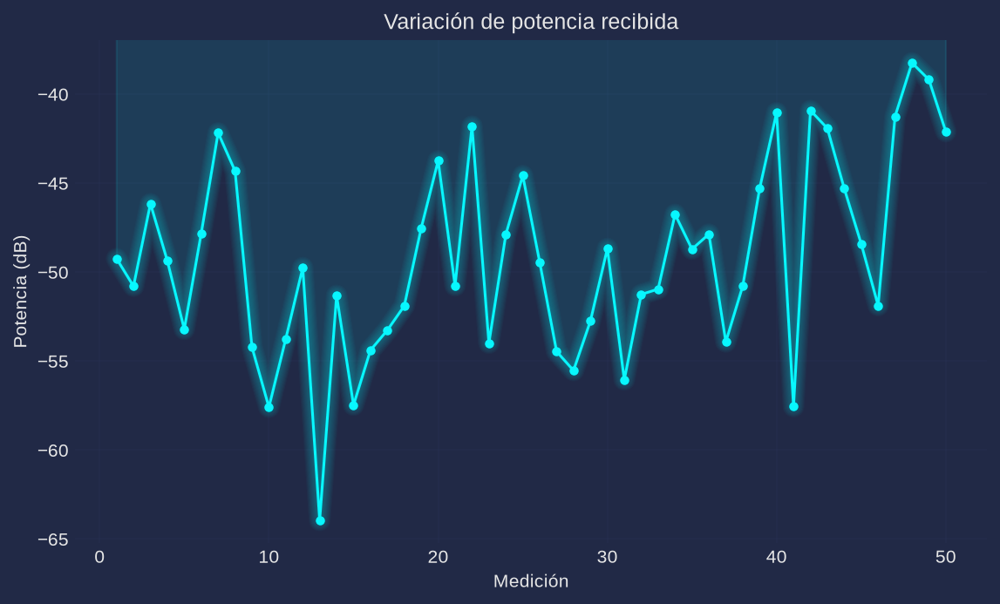
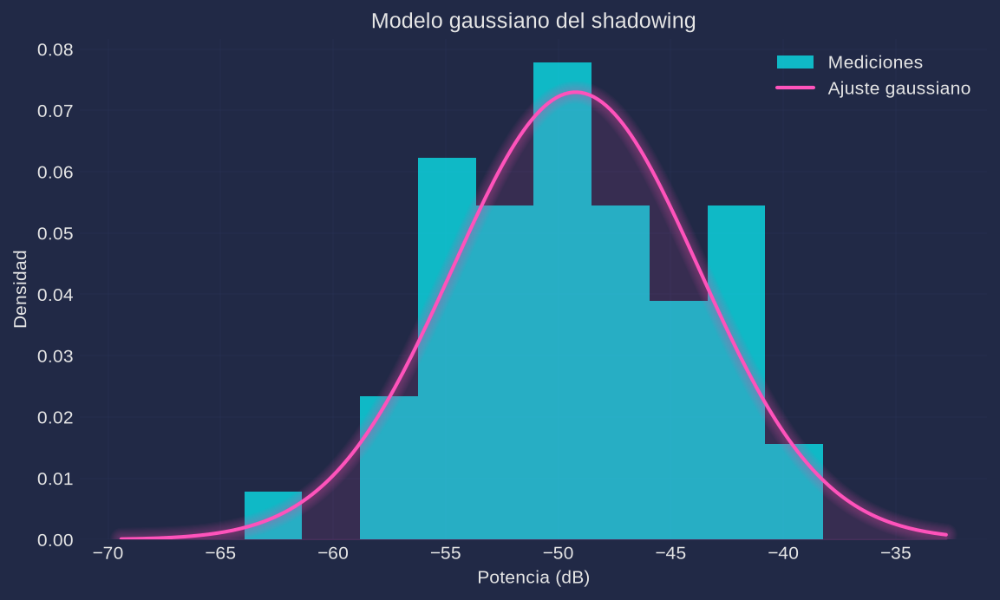

# Práctica 3. Caracterización experimental del shadowing log-normal

**Materia:** Comunicaciones Inalámbricas
**Equipo:** RTL-SDR (`RTL2832U` + tuner `R820T`), antena telescópica
**Script:** [`practica3.py`](practica3.py) (Python; en este repo el análisis se hace en Python en lugar de MATLAB)

---

## 1. Objetivo

Caracterizar las variaciones lentas de potencia (shadowing o desvanecimiento de gran escala) de un canal inalámbrico real: medir la potencia recibida $P_r(k)$ en 50 posiciones independientes a distancia fija (10 m), estimar la media $\mu$ y la desviación estándar $\sigma$ del shadowing, verificar si las mediciones siguen una distribución aproximadamente normal y obtener su ajuste gaussiano, complementando el modelo de pérdidas por trayectoria.

## 2. Fundamento teórico

Además de la pérdida media por trayectoria, la señal experimenta fluctuaciones lentas por obstáculos (edificios, paredes, mobiliario, vegetación, personas), modeladas por el shadowing log-normal:

$$PL(d) = PL(d_0) + 10\,n\,\log_{10}\!\left(\frac{d}{d_0}\right) + X_\sigma, \qquad X_\sigma \sim \mathcal{N}(0, \sigma^2)$$

donde $PL(d_0)$ es la pérdida a la distancia de referencia, $n$ el exponente de pérdidas y $X_\sigma$ una variable aleatoria gaussiana en dB de media cero y desviación estándar $\sigma$.

La potencia recibida de cada medición se estima de las muestras IQ como

$$P = \frac{1}{M}\sum_{m=1}^{M} |x[m]|^2, \qquad P_r(k) = 10\log_{10}(P)\ \text{(dB)}$$

y los estimadores muestrales de la media y la desviación estándar son

$$\mu = \frac{1}{N}\sum_{k=1}^{N} P_r(k), \qquad \sigma = \sqrt{\frac{1}{N-1}\sum_{k=1}^{N}\left(P_r(k)-\mu\right)^2}$$

El ajuste gaussiano se obtiene por máxima verosimilitud con `scipy.stats.norm.fit` ($\mu_{fit}$, $\sigma_{fit}$). Si se remueve la pérdida media por trayectoria, las fluctuaciones residuales deben aproximarse a $\mathcal{N}(0,\sigma^2)$, de modo que la normalidad de $P_r$ se contrasta con la prueba de Shapiro-Wilk. Valores típicos de $\sigma$:

| Entorno | σ (dB) |
|---|---|
| Espacio libre | 2 – 4 |
| Exterior urbano | 6 – 10 |
| Interior oficinas | 4 – 12 |
| Entornos industriales | 8 – 15 |

## 3. Desarrollo experimental

### 3.1 Configuración del receptor

| Parámetro | Valor |
|---|---|
| Frecuencia central | 433.9 MHz (banda ISM de 433 MHz) |
| Sample rate | 2.4 MSPS |
| Muestras por medición (`--frame`) | 4096 |
| Mediciones independientes (`--nmed`) | 50 |
| Distancia transmisor–receptor (`--distancia`) | 10.0 m |
| Ganancia (`--gain`) | auto (la mayor que no recorta el ADC) |
| Pausa entre mediciones (`--pausa`) | 1.0 s |
| Antena | telescópica del RTL-SDR |

### 3.2 Escenario

Fuente transmisora fija y distancia constante de 10 m entre transmisor y receptor. La antena/receptor se reubica entre mediciones en posiciones cercanas al punto de recepción para modificar el entorno sin cambiar apreciablemente la distancia: pasillo, interior de oficina, cerca de paredes, cerca de puertas y con presencia/ausencia de personas.

### 3.3 Procedimiento

1. `python3 practica3.py` avisa al usuario que mueva la antena/receptor entre mediciones.
2. En cada una de las 50 posiciones se captura un frame de 4096 muestras IQ y se calcula $P_r(k) = 10\log_{10}(\text{mean}(|data|^2))$; se imprime el progreso cada 10 mediciones y se espera `--pausa` segundos.
3. Las 50 mediciones se guardan en `datos/mediciones.csv` (índice y potencia en dB).
4. Se calculan $\mu$, $\sigma$, el ajuste gaussiano, el intervalo de confianza aproximado de $\sigma$ y la prueba de normalidad; todo se guarda en `datos/resultados.json`.
5. Se generan `figs/variacion.png` y `figs/histograma.png`.

## 4. Código

El script completo está en [`practica3.py`](practica3.py). Fragmentos esenciales:

```python
Pr[k] = comun.potencia_dbfs(comun.capturar(freq, n=frame, ganancia=ganancia))  # [data,len]=rx(); Pr(k)=10*log10(P)
mu, sigma = float(np.mean(Pr)), float(np.std(Pr, ddof=1))                      # mu=mean(Pr); sigma=std(Pr)
mu_fit, sigma_fit = stats.norm.fit(Pr)                                         # pd=fitdist(Pr,'Normal')
p = stats.shapiro(Pr).pvalue                                                   # prueba de normalidad
ax.hist(Pr, bins=10, density=True)                                             # histogram(Pr,'Normalization','pdf')
ax.plot(x, stats.norm.pdf(x, mu_fit, sigma_fit))                               # plot(x, pdf(pd,x))
```

## 5. Resultados

> **Nota:** **los resultados y figuras de esta sección corresponden a la corrida de verificación por simulación (`python3 practica3.py --sim`), no a una medición real del canal; se reemplazan por los datos de la corrida real (`python3 practica3.py`) al ejecutar la práctica con el transmisor y el RTL-SDR.**

### 5.1 Tabla de resultados

| Parámetro | Valor |
|---|---|
| Media µ (dB) | −49.23 |
| Desviación σ (dB) | 5.52 |
| σ del ajuste gaussiano (MLE) | 5.47 |
| N mediciones | 50 |
| Distancia | 10.0 m |
| p-valor (Shapiro-Wilk) | 0.6166 |
| IC 95 % aproximado de σ | [4.43, 6.62] dB |
| Entorno (clasificado por σ) | interior con poca obstrucción |

### 5.2 Variación de potencia recibida



La potencia fluctúa alrededor de −49.2 dB con excursiones entre aproximadamente −64 y −38 dB, típicas de un canal con shadowing. No se observa tendencia creciente ni decreciente, lo que indica que la distancia se mantuvo constante.

### 5.3 Histograma y ajuste gaussiano



El histograma normalizado a pdf presenta una forma acampanada, simétrica alrededor de la media, y la curva gaussiana ajustada lo sigue de cerca; no se aprecian colas pesadas ni bimodalidad marcadas.

## 6. Análisis de resultados

- **Normalidad:** el p-valor de la prueba de Shapiro-Wilk (0.6166) es muy superior a 0.05, por lo que **no se rechaza** la hipótesis de normalidad de $P_r$; las mediciones son compatibles con el modelo log-normal del shadowing. Además, $\mu_{fit} \approx \mu$ (−49.23 dB) y la diferencia entre $\sigma$ muestral (5.52 dB) y $\sigma_{fit}$ (5.47 dB) se debe solo al estimador ($N-1$ vs. máxima verosimilitud).
- **Comparación con la literatura:** $\sigma = 5.52$ dB cae dentro del rango de **interior de oficinas (4–12 dB)** y en el borde inferior del rango de exterior urbano (6–10 dB); está por encima del espacio libre (2–4 dB). El intervalo de confianza [4.43, 6.62] dB es consistente con un ambiente interior con obstáculos moderados (paredes, muebles, puertas, personas), no con línea de vista despejada.
- **Elementos del entorno:** las paredes, puertas y la presencia de personas son los obstáculos que más modifican la potencia recibida, porque atenúan y difractan la señal de manera distinta en cada posición aun manteniendo la misma distancia.
- **Pérdida por trayectoria vs. shadowing:** la pérdida media $PL(d)$ decae de forma determinista con la distancia según $n$; el shadowing es la componente aleatoria $X_\sigma$ que dispersa las mediciones alrededor de esa media. El modelo completo requiere ambas.
- **Hardware:** con `--sim` se valida todo el pipeline sin dongle. En la corrida real, el valor de $\mu$ depende de la calibración del receptor (dBFS relativos, no dBm absolutos), pero $\sigma$ es independiente de la escala y por eso es la métrica robusta del shadowing.

## 7. Cuestionario

1. **¿Qué es el shadowing?**
   Es el desvanecimiento de gran escala: las variaciones lentas de la potencia media recibida causadas por obstáculos que bloquean, absorben o difractan la señal (edificios, paredes, árboles, personas). Se modela superponiendo a la pérdida por trayectoria una variable aleatoria gaussiana en dB, $X_\sigma \sim \mathcal{N}(0,\sigma^2)$, de modo que la potencia lineal resulta log-normal.

2. **¿Qué diferencia existe entre fading de gran escala y de pequeña escala?**
   El fading de gran escala (shadowing) se debe a obstáculos entre transmisor y receptor y varía lentamente, sobre distancias de muchos metros o cientos de longitudes de onda; afecta la potencia media local. El de pequeña escala (multitrayectoria, Rayleigh/Rician) se debe a la interferencia de réplicas que llegan con retrasos y fases distintas, varía rápidamente (distancias del orden de $\lambda$ o fracciones) y produce desvanecimientos profundos y selectivos en frecuencia.

3. **¿Por qué el shadowing suele modelarse log-normal?**
   Porque la pérdida en dB producida por cada obstáculo es aditiva: la atenuación total es la suma de muchas contribuciones independientes. Por el teorema central del límite, esa suma tiende a una distribución gaussiana, por lo que la pérdida en dB (el logaritmo de la potencia lineal) es normal; en consecuencia, la potencia lineal sigue una distribución log-normal.

4. **¿Qué representa físicamente σ?**
   La dispersión o intensidad del shadowing: cuánto se apartan las mediciones de la pérdida media por trayectoria a una misma distancia. Físicamente resume la agresividad y variabilidad de los obstáculos del entorno: a mayor $\sigma$, mayor incertidumbre en el nivel de potencia recibida y peor predictibilidad del enlace.

5. **¿Cómo afecta el entorno interior al valor de σ?**
   Lo incrementa respecto del espacio libre (4–12 dB frente a 2–4 dB), porque en interiores hay gran cantidad y variedad de obstáculos (muros, divisiones, muebles, puertas, personas en movimiento) con atenuaciones muy distintas entre posiciones. Ambientes interiores abiertos o con línea de vista directa tienden al extremo inferior del rango, mientras que oficinas densamente amuebladas o con tráfico de personas se acercan al extremo superior.

## 8. Conclusiones

Se implementó y verificó el pipeline completo de caracterización del shadowing: adquisición de $N_{med}$ frames IQ a distancia fija, cálculo de $P_r(k) = 10\log_{10}(\text{mean}(|data|^2))$, estimación de $\mu$ y $\sigma$, ajuste gaussiano, prueba de normalidad y visualización. En la verificación por simulación ($\mathcal{N}(-50, 6)$ dB) se obtuvo $\mu = -49.23$ dB, $\sigma = 5.52$ dB, $p = 0.6166$, de modo que las mediciones pasan la prueba de normalidad y el valor de $\sigma$ es consistente con el parámetro simulado y con los rangos típicos de interiores (4–12 dB). El script queda listo para la corrida real (`python3 practica3.py`), donde los archivos `datos/mediciones.csv` y `datos/resultados.json` y las figuras se regenerarán con las 50 posiciones medidas; la validación sin hardware con `python3 practica3.py --selftest` confirma que la lógica estadística es correcta.
