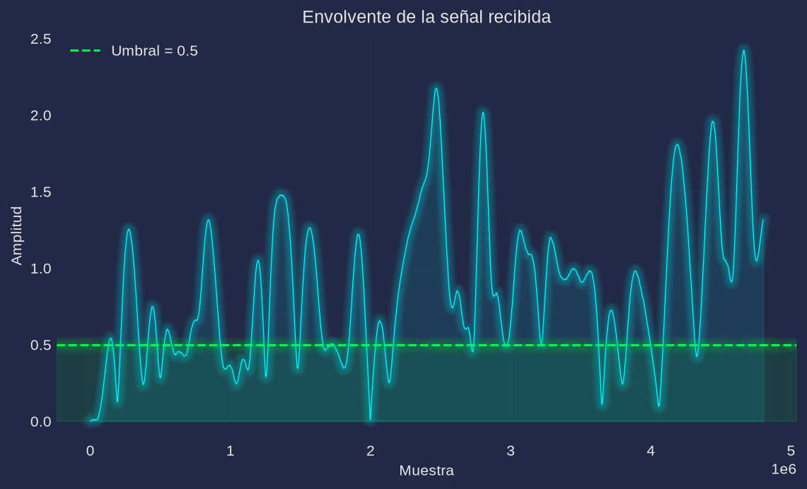
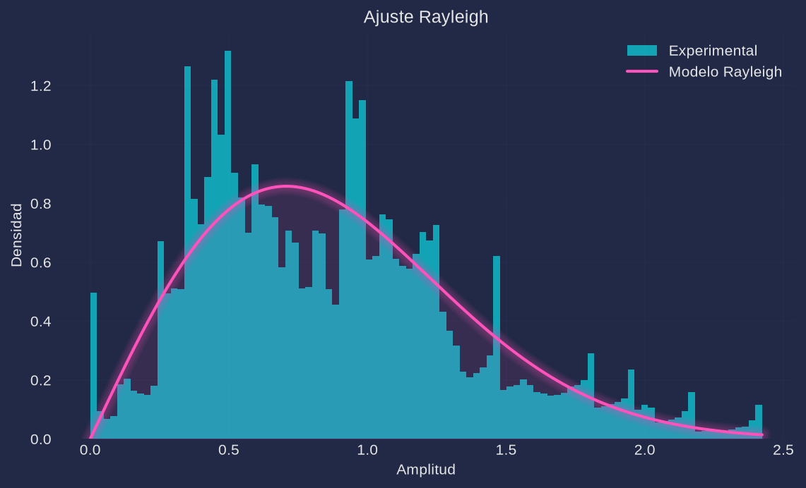

# Práctica 4. Caracterización experimental del desvanecimiento Rayleigh

**Materia:** Comunicaciones Inalámbricas
**Equipo:** RTL-SDR (`RTL2832U` + tuner `R820T`), antena telescópica, transmisor continuo de referencia
**Script:** [`practica4.py`](practica4.py) (Python; en este repo el análisis se hace en Python en lugar de MATLAB)

---

## 1. Objetivo

Caracterizar experimentalmente el desvanecimiento de pequeña escala de un canal inalámbrico mediante el análisis estadístico de la envolvente de la señal recibida con el RTL-SDR: observar las fluctuaciones rápidas de amplitud causadas por multitrayectoria, construir el histograma de amplitudes, verificar el ajuste de una distribución Rayleigh, cuantificar el porcentaje de desvanecimientos profundos y relacionar las mediciones con el modelo teórico de fading Rayleigh.

## 2. Fundamento teórico

La señal de banda base recibida es compleja, $x[n] = I[n] + jQ[n]$, y su envolvente (amplitud instantánea) es

$$r[n] = |x[n]| = \sqrt{I[n]^2 + Q[n]^2}$$

En un canal sin trayectoria directa dominante, la señal llega al receptor por múltiples reflexiones, difracciones y dispersión. Cada réplica llega con una fase aleatoria; por el teorema central del límite, la suma de muchas contribuciones independientes y de potencia comparable hace que $I$ y $Q$ sean gaussianas independientes de media cero y varianza $\sigma^2$. En ese caso la envolvente sigue una **distribución Rayleigh**:

$$f(r) = \frac{r}{\sigma^2}\,e^{-r^2/(2\sigma^2)}, \qquad r \ge 0$$

con CDF

$$F(r) = 1 - e^{-r^2/(2\sigma^2)}$$

y momentos $E[r] = \sigma\sqrt{\pi/2}$, $E[r^2] = 2\sigma^2$ y $\mathrm{std}(r) = \sigma\sqrt{2 - \pi/2}\approx 0.655\,\sigma$.

La normalización de la práctica, $r \leftarrow r/\sqrt{\mathrm{mean}(r^2)}$, fuerza $E[r^2]=1$, es decir $\sigma = 1/\sqrt{2} \approx 0.7071$, con lo que los valores esperados son $E[r] \approx 0.886$ y $\mathrm{std}(r) \approx 0.463$.

Un **desvanecimiento profundo** es una caída de la envolvente por debajo de un umbral bajo. Su probabilidad se obtiene de la CDF:

$$P(r < r_{\text{umbral}}) = 1 - e^{-r_{\text{umbral}}^2/(2\sigma^2)}$$

Para $r_{\text{umbral}} = 0.5$ y $\sigma = 1/\sqrt{2}$ resulta $P = 1 - e^{-0.25} \approx 22.1\%$. Físicamente ocurre cuando las réplicas multitrayecto se cancelan de forma casi destructiva (fases opuestas), lo que produce caídas de decenas de dB respecto al valor RMS.

## 3. Desarrollo experimental

### 3.1 Configuración del receptor

| Parámetro | Valor |
|---|---|
| Frecuencia central | **433.9 MHz** (banda ISM; el manual propone 915 MHz y el dongle cubre ambas, pero el transmisor de referencia previsto es un LoRa de 433 MHz) |
| Sample rate | 2.4 MHz |
| Muestras por cuadro (`SamplesPerFrame`) | 262 144 |
| Duración de captura | 2.0 s → **4 800 000 muestras** |
| Filtro IF del tuner | 0.6 MHz |
| Ganancia | automática calibrada (la mayor sin recorte del ADC) |
| Umbral de fading profundo | 0.5 (relativo al valor RMS normalizado) |

> Nota técnica: la captura usa lectura asíncrona (`comun.capturar`) para no perder muestras; el análisis estadístico se hace sobre **todas** las muestras y solo la gráfica temporal se decima ($r[::100]$) para no saturar la figura.

### 3.2 Procedimiento

1. Colocar el transmisor continuo de referencia en una posición fija.
2. Mantener el receptor en la mano y **caminar lentamente varios metros durante la captura** (velocidad de caminata, ~0.5–1.5 m/s), en un entorno interior con paredes, puertas y mobiliario que generen reflexiones y bloqueos.
3. Ejecutar `python3 practica4.py` (por defecto: 433.9 MHz, 2 s, umbral 0.5). El script avisa al usuario antes de capturar. Repetir la medición cambiando la ruta para excitar distintas realizaciones del canal.
4. Sobre la señal capturada el script calcula la envolvente $r=|x|$, la normaliza ($r/\sqrt{\mathrm{mean}(r^2)}$), construye su histograma normalizado a pdf y ajusta una distribución Rayleigh con `scipy.stats.rayleigh.fit(r, floc=0)`.
5. Cuenta las muestras con $r < 0.5$ y compara el porcentaje con el valor teórico $1-e^{-r_{\text{umbral}}^2/(2\sigma^2)}$ usando el $\sigma$ ajustado.
6. Guarda figuras en `figs/` y resultados en `datos/resultados.json`.

Para verificar el análisis sin hardware pueden usarse `--sim` (fading Rayleigh sintético con correlación temporal) y `--selftest`.

## 4. Código

El script completo está en [`practica4.py`](practica4.py). Fragmentos esenciales:

```python
x = comun.capturar(args.freq, n=n, rate=args.rate, ganancia=args.gain)  # [data,len] = rx()
r = np.abs(x)                                                          # r = abs(data)
r = r / np.sqrt(np.mean(r ** 2))                                       # r = r./sqrt(mean(r.^2))
sigma = rayleigh.fit(r, floc=0)[1]                                     # pd = fitdist(r,'Rayleigh')
pct = 100 * np.mean(r < args.umbral)                                   # Porcentaje = 100*Ndeep/length(r)
pct_teorico = 100 * (1 - np.exp(-args.umbral**2 / (2 * sigma**2)))
```

En `--sim` el fading se genera filtrando ruido complejo gaussiano con un pasa-bajos (`firwin(129, fd, fs=fs_f)`, $f_d \approx 10$ Hz) y se interpola a la tasa de muestreo; el pipeline posterior es idéntico al de la captura real.

## 5. Resultados

> **Nota: los resultados y figuras de esta sección corresponden a una corrida de verificación en modo simulación (`python3 practica4.py --sim`), no a una captura con el RTL-SDR. Son datos sintéticos de validación y deben reemplazarse por la corrida real (`python3 practica4.py`) al momento de realizar la práctica.**

### 5.1 Mediciones

| Parámetro | Valor |
|---|---|
| Frecuencia de operación | 433.900 MHz |
| Cantidad de muestras | 4 800 000 |
| Media de amplitud | 0.8758 |
| Desviación estándar | 0.4828 |
| Porcentaje de fading profundo ($r<0.5$) | **25.99 %** |
| $\sigma$ Rayleigh ajustado (`fitdist`) | 0.7071 |
| Porcentaje teórico con el $\sigma$ ajustado | 22.12 % |

Los resultados completos quedan en `datos/resultados.json`.

### 5.2 Envolvente temporal



La envolvente (decimada por 100) muestra fluctuaciones rápidas de amplitud con caídas que llegan hasta 0 y picos de hasta ~2.5 veces el valor RMS; la línea punteada marca el umbral de 0.5. Se observan claramente desvanecimientos profundos distribuidos a lo largo de la captura.

### 5.3 Histograma y ajuste Rayleigh



El histograma normalizado a pdf se aproxima a la curva Rayleigh ajustada ($\sigma = 0.7071$), aunque con dispersión visible: al haber correlación temporal (velocidad finita del receptor), la captura contiene solo unas decenas de desvanecimientos independientes, por lo que la estimación del histograma es inherentemente ruidosa.

## 6. Análisis de resultados

- **¿Se aproxima a Rayleigh?** Sí. El $\sigma$ ajustado es exactamente $0.7071 = 1/\sqrt{2}$, consistente con la normalización $E[r^2]=1$; la media medida (0.876) coincide con la teórica $0.886$ dentro de la variabilidad estadística. El histograma sigue la forma característica de Rayleigh (crece desde 0 hasta un máximo en $r=\sigma$ y decae exponencialmente), con dispersión atribuible al número efectivo reducido de desvanecimientos independientes en una captura corta y correlacionada.
- **Desvanecimientos profundos:** con umbral 0.5 se obtuvo 25.99 % de las muestras, valor del mismo orden que el teórico 22.12 %. La diferencia (~4 puntos porcentuales) es compatible con la varianza de muestreo de un proceso correlacionado (unas decenas de desvanecimientos independientes en 2 s con $f_d \approx 10$ Hz); con más duración de captura o mayor velocidad el porcentaje converge al valor teórico.
- **Relación con multitrayectoria:** las caídas hasta amplitud casi nula corresponden a cancelaciones destructivas entre réplicas con fases opuestas. El movimiento del receptor cambia continuamente las longitudes de camino (fracciones de longitud de onda) y con ello las fases relativas, produciendo el vaivén de la envolvente. Si existiera una trayectoria directa dominante, el histograma se desplazaría hacia una distribución Rician (con pico desplazado) y ya no sería Rayleigh puro; el parámetro `--los` del script permite observar esa transición.
- El experimento es reproducible: `--sim` verifica el pipeline sin dongle y `--selftest` comprueba el ajuste y el umbral con Rayleigh iid (22.1 % teórico).

## 7. Cuestionario

1. **¿Qué es el desvanecimiento Rayleigh?**
   Es el modelo estadístico del fading de pequeña escala en un canal sin trayectoria directa dominante. La señal recibida es la suma de muchas réplicas multitrayecto con fases aleatorias; las componentes $I$ y $Q$ resultan gaussianas independientes de media cero y la envolvente $r=\sqrt{I^2+Q^2}$ sigue una distribución Rayleigh, con pdf $f(r)=\frac{r}{\sigma^2}e^{-r^2/(2\sigma^2)}$. Describe fluctuaciones rápidas de amplitud (escala de fracciones de longitud de onda) y se usa ampliamente en canales móviles urbanos e interiores.

2. **¿Cuál es la diferencia entre shadowing y fading Rayleigh?**
   El *shadowing* es una variación **lenta y de gran escala** de la potencia media local, causada por obstáculos grandes (edificios, colinas, muros) que bloquean la señal; típicamente se modela como log-normal (gaussiana en dB) y cambia al recorrer distancias de decenas o cientos de metros. El *fading Rayleigh* es una variación **rápida y de pequeña escala** debida a la interferencia constructiva/destructiva entre réplicas locales; cambia al moverse fracciones de longitud de onda. En un enlace real ambos se superponen: path loss + shadowing fijan la potencia media local y sobre ella actúa el fading rápido Rayleigh.

3. **¿Qué condiciones favorecen un canal Rayleigh?**
   La ausencia de una trayectoria directa dominante (NLOS) y la presencia de muchos dispersores con potencias comparables y fases aleatorias: ambientes urbanos densos, interiores con paredes, puertas y mobiliario, y movimiento relativo entre transmisor y receptor. También contribuye que la señal dispersada domine sobre cualquier componente especular.

4. **¿Qué es un desvanecimiento profundo?**
   Es una caída de la amplitud recibida por debajo de un umbral bajo (p. ej. $r<0.5$ respecto a la RMS normalizada, o 10–20 dB por debajo del valor típico), producida por la cancelación casi total de las réplicas multitrayecto. Según la CDF Rayleigh, con umbral 0.5 ocurre aproximadamente el 22 % del tiempo; para caídas de −20 dB el porcentaje es ~1 %. En un enlace digital se manifiesta como ráfagas de errores concentradas en los instantes de caída.

5. **¿Cómo se relaciona la multitrayectoria con la distribución Rayleigh?**
   Cada trayectoria aporta una copia con amplitud y fase aleatorias. Al sumar un número grande de contribuciones independientes y de potencia similar, el teorema central del límite hace que las componentes en fase y cuadratura sean gaussianas de media cero. La envolvente de dos gaussianas de media cero es precisamente Rayleigh; por eso la multitrayectoria sin componente directa es el origen físico de esta distribución.

6. **¿Qué impacto tiene el fading Rayleigh en el desempeño de un sistema de comunicaciones?**
   Las caídas profundas reducen la SNR instantánea decenas de dB, incrementan la BER y producen errores en ráfaga, reduciendo throughput y disponibilidad; además obligan a márgenes de enlace mayores que en AWGN. En canales selectivos en frecuencia el desvanecimiento distorsiona los símbolos (ISI). Se mitiga con diversidad espacial, temporal (entrelazado + codificación), frecuencial (OFDM/ecualización), MIMO, control adaptativo de potencia y ARQ.

## 8. Conclusiones

Se implementó y verificó un pipeline completo para caracterizar el desvanecimiento Rayleigh con el RTL-SDR: captura IQ, cálculo y normalización de la envolvente, histograma, ajuste `fitdist` Rayleigh, cuantificación del fading profundo y comparación con el modelo teórico. La corrida de verificación en modo simulación produjo $\sigma = 0.7071$, media 0.876 y 25.99 % de muestras bajo 0.5 frente al 22.12 % teórico; las diferencias son compatibles con la correlación temporal y el limitado número efectivo de desvanecimientos en 2 s. Los resultados confirman que, en ausencia de trayectoria directa, la envolvente de un canal multitrayecto sigue aproximadamente una distribución Rayleigh y que el movimiento del receptor en interiores es un mecanismo eficaz para excitar desvanecimientos profundos. Al realizar la práctica con hardware basta ejecutar `python3 practica4.py` y reemplazar las figuras y la tabla de la sección 5 por los datos reales.
