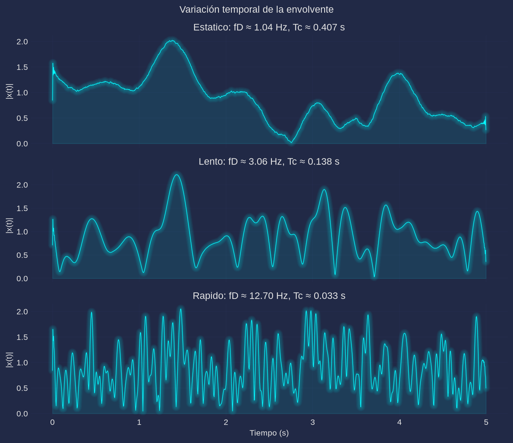
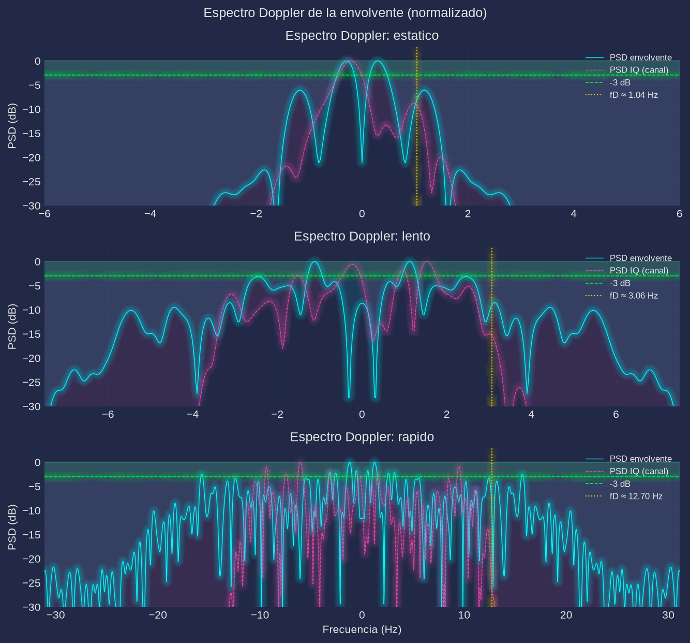

# Práctica 5. Caracterización experimental del efecto Doppler y tiempo de coherencia

**Materia:** Comunicaciones Inalámbricas
**Equipo:** RTL-SDR (`RTL2832U` + tuner `R820T`), antena telescópica, fuente CW en 433.9 MHz
**Script:** [`practica5.py`](practica5.py) (Python; el análisis MATLAB del manual se implementa con NumPy/SciPy)

---

## 1. Objetivo

Analizar experimentalmente el efecto Doppler en un canal inalámbrico móvil a partir de la envolvente de una fuente de onda continua (CW) recibida en tres escenarios de movilidad del receptor (estático, caminando lento y caminando rápido). Se busca:

- Observar la variación temporal de la envolvente del canal.
- Obtener el espectro Doppler de la envolvente y del canal.
- Estimar la frecuencia Doppler máxima $f_D$.
- Calcular el tiempo de coherencia $T_c \approx 0.423/f_D$ y relacionarlo con la velocidad.

## 2. Fundamento teórico

### 2.1 Efecto Doppler

Cuando el receptor se mueve respecto al transmisor con velocidad relativa $v$, la frecuencia observada difiere de la transmitida:

$$f = f_c\left(1 \pm \frac{v}{c}\right) \quad\Rightarrow\quad \Delta f = \frac{v}{\lambda}\cos\theta$$

donde $\lambda = c/f_c$ es la longitud de onda y $\theta$ es el ángulo entre la dirección de movimiento y la dirección de llegada de la onda. La **frecuencia Doppler máxima** ocurre para $\theta = 0$:

$$f_D = \frac{v}{\lambda} = \frac{v\,f_c}{c}$$

Para 433.9 MHz, $\lambda = 0.691$ m, de modo que $f_D \approx 1.45\,\mathrm{Hz}$ por cada m/s de velocidad. En un canal con multitrayectoria, cada réplica llega con un ángulo (y por tanto un desplazamiento Doppler) distinto: la superposición ensancha el espectro alrededor de $f_c$ y hace que la amplitud y la fase de la señal varíen en el tiempo (**desvanecimiento selectivo en el tiempo**).

### 2.2 Espectro Doppler

Para dispersión isotrópica (modelo de Clarke/Jakes) el espectro de potencia del canal en banda base tiene forma de "U" con soporte $[-f_D, f_D]$ y densidades infinitas en los bordes. La dispersión Doppler (ancho del espectro) es del orden de $2f_D$ entre primer y último rayo.

La **envolvente** $r(t) = |x(t)|$ de una señal CW desvanecida fluctúa con la misma escala de tiempo. Su espectro de fluctuaciones (con la media removida) es aproximadamente la **autoconvolución** del espectro Doppler del canal, por lo que se extiende hasta $\approx 2f_D$ y resulta $\approx\sqrt{2}$ más ancha que el espectro del canal complejo.

### 2.3 Tiempo de coherencia

El tiempo de coherencia $T_c$ es el intervalo durante el cual la respuesta del canal puede considerarse aproximadamente constante (la autocorrelación temporal se mantiene por encima de un umbral, típicamente 0.5). Se aproxima mediante

$$T_c \approx \frac{0.423}{f_D}$$

de modo que $T_c$ es inversamente proporcional a la velocidad: a mayor movilidad, canal más rápido y menor $T_c$. Valores de referencia para 433.9 MHz:

| Escenario | $f_D$ (Hz) | $v = f_D\lambda$ (m/s) | $v$ (km/h) | $T_c$ teórico (s) |
|---|---|---|---|---|
| Estático (leve balanceo) | 0.2 | 0.14 | 0.5 | 2.115 |
| Caminando lento | 3.0 | 2.07 | 7.5 | 0.141 |
| Caminando rápido | 12.0 | 8.29 | 29.9 | 0.035 |

> El mismo $f_D$ corresponde a velocidades menores si se sube la frecuencia portadora (en 915 MHz, como en el manual, $\lambda = 0.328$ m: $f_D = 3$ Hz equivale a 0.98 m/s y 12 Hz a 3.9 m/s).

## 3. Desarrollo experimental

### 3.1 Configuración del receptor

| Parámetro | Valor |
|---|---|
| Chip / tuner | RTL2832U / R820T |
| Frecuencia central | **433.9 MHz** (banda ISM; el manual propone 915 MHz) |
| Sample rate | 240 kHz (como el manual) |
| Muestras por escenario | $n = \lfloor 5\,\mathrm{s}\cdot 240\,\mathrm{kHz}\rfloor = 1\,200\,000$ |
| Filtro IF del tuner | 600 kHz (`comun.capturar`) |
| Ganancia | `auto`: la mayor que no recorta el ADC (`--gain` permite fijarla) |
| Antena | telescópica conectada al RX |
| Captura | asíncrona, sin pérdida de muestras (`comun.capturar`) |

### 3.2 Escenarios

| Escenario | $f_D$ nominal | Instrucción al usuario |
|---|---|---|
| `estatico` | 0.2 Hz | Permanecer quieto con el receptor en la mano |
| `lento` | 3 Hz | Caminar despacio y sostener el paso durante los 5 s de captura |
| `rapido` | 12 Hz | Caminar rápido y sostener el paso durante los 5 s de captura |

El transmisor CW permanece fijo; solo se mueve el receptor. El modo real pide confirmación por escenario con `input()` y captura `n = int(dur*rate)` muestras con `comun.capturar`. El modo `--sim` genera los mismos escenarios sin dongle y `--selftest` verifica el estimador.

### 3.3 Procedimiento

1. `python3 practica5.py` (real) o `python3 practica5.py --sim` (sintético).
2. Por escenario se obtiene la envolvente $r=|x|$ y su PSD con Welch.
3. Se estima $f_D$ y se calcula $T_c = 0.423/f_D$.
4. Se guardan `figs/envolventes.png`, `figs/doppler.png` y `datos/resultados.json`.

**Simulación (`--sim`).** El desvanecimiento se genera con un modelo simplificado de Jakes: ruido complejo gaussiano filtrado pasa-bajos con un FIR de 257 taps cuyo ancho de banda es $f_D$, multiplicado por una portadora compleja constante (equivalente al IQ de una fuente CW). El FIR se aplica a la tasa de la envolvente (240 Hz) porque a 240 kHz un FIR de 257 taps tiene una banda de transición de ≈1.5 kHz, tres órdenes de magnitud mayor que $f_D$; la envolvente resultante se interpola en banda base a 240 kHz mediante relleno de ceros espectral. Se usa una semilla fija (`SEMILLA = 42`) para que los resultados sean reproducibles.

## 4. Código

El script completo está en [`practica5.py`](practica5.py). Fragmentos esenciales:

```python
# Simulación: ruido complejo gaussiano filtrado con FIR de 257 taps a fs_env = 240 Hz
h = lfilter(firwin(257, fd, fs=fs/L), 1.0, ruido_complejo)[257:]
h /= np.sqrt(np.mean(np.abs(h)**2))
x = _interpolar(h, L)[:n] * np.exp(1j*np.pi/4)          # portadora CW constante

# PSD de Welch centrada (método del manual para el IQ)
f_man, P_man = _psd(x, fs, 4096, 2048, 4096)             # welch(x, fs, 4096, 2048, 4096)

# Espectro Doppler de la envolvente (decimada a 240 Hz para resolver pocos Hz)
xd = resample_poly(x, 1, L)
r = np.abs(xd)
f_env, P_env = _psd(r - r.mean(), fs/L, 1024, nfft=8192)

# Estimación: ancho RMS y corrección por autoconvolución
sigma = np.sqrt((f_env**2 * P_env).sum() / P_env.sum())
fD = np.sqrt(1.5) * sigma
Tc = 0.423 / fD
```

La PSD del IQ a la tasa completa (`welch(x, fs, 4096, 2048, 4096, return_onesided=False)`) se conserva por ser el método del manual, pero su resolución es $f_s/4096 = 58.6$ Hz: no puede resolver $f_D$ de pocos Hz. Por eso el espectro Doppler se calcula sobre la envolvente decimada a 240 Hz (anti-alias con `resample_poly`), donde la resolución es de 0.03 Hz.

## 5. Resultados

> **Los resultados de esta sección corresponden a una verificación por simulación (`--sim`, semilla fija) y NO a la corrida real.** Se muestran para validar el procesamiento sin ocupar el dongle; deben reemplazarse con los datos de la corrida real con el transmisor CW y el receptor en movimiento.

### 5.1 Mediciones

| Escenario | $f_D$ teórico (Hz) | $f_D$ estimado (Hz) | $T_c$ teórico (s) | $T_c$ medido (s) | Ancho RMS $\sigma$ (Hz) |
|---|---|---|---|---|---|
| Estático | 0.2 | 1.04 | 2.115 | 0.407 | 0.85 |
| Lento | 3.0 | 3.06 | 0.141 | 0.138 | 2.50 |
| Rápido | 12.0 | 12.70 | 0.035 | 0.033 | 10.37 |

Salida de consola de la corrida:

```
| Escenario | fD (Hz) | Tc (s) | Ancho PSD (Hz) |
|---|---|---|---|
| Estatico | 1.04 | 0.407 | 0.85 |
| Lento | 3.06 | 0.138 | 2.50 |
| Rapido | 12.70 | 0.033 | 10.37 |
```

`--selftest` (escenario lento, exige $1.5 < f_D < 6$ Hz):

```
practica5 selftest OK
```

### 5.2 Variación temporal de la envolvente



La envolvente estática varía lentamente (unos pocos desvanecimientos en 5 s); al caminar lento aparecen mínimos profundos separados por décimas de segundo, y al caminar rápido la amplitud cambia varias veces por segundo. El ritmo de fluctuación crece con la velocidad, como predice $f_D = v/\lambda$.

### 5.3 Espectro Doppler



En cada panel se muestra la PSD normalizada de la envolvente (línea llena, media removida) y la PSD del canal IQ (discontinua), con la línea de −3 dB y el valor estimado de $f_D$. El ensanchamiento del espectro es evidente: la anchura RMS pasa de 0.85 Hz (estático) a 2.50 Hz (lento) y 10.37 Hz (rápido), aproximadamente proporcional a $f_D$. La PSD de la envolvente es más ancha que la del canal porque es su autoconvolución.

### 5.4 Criterio de estimación

El cruce puntual de −3 dB sobre la PSD de la envolvente resultó poco confiable con registros de 5 s (pocos ciclos de desvanecimiento y alto rizo del periodograma: valores de 0.50, 1.31 y 1.52 Hz que no escalan con la velocidad). Se adoptó un **ancho RMS**: para un espectro Doppler plano de ancho $f_D$, la PSD de las fluctuaciones de la envolvente es su autoconvolución (triangular) y su varianza es $\sigma^2 = 2f_D^2/3$; por lo tanto

$$f_D = \sqrt{\tfrac{3}{2}}\,\sigma$$

El estimador es lineal con la velocidad (3.06 y 12.70 Hz frente a 3 y 12 Hz nominales) y el cruce crudo de −3 dB se conserva en `datos/resultados.json` como `ancho_3dB_Hz`.

En el escenario estático el valor medido (1.04 Hz) no es el $f_D$ real (0.2 Hz) sino el **piso de resolución del método**: con 5 s de registro solo se observa 1 ciclo de un proceso de 0.2 Hz, y el FIR de 257 taps tampoco puede tener una banda de transición menor que ≈1 Hz. Para medirlo habría que capturar varias decenas de segundos.

## 6. Análisis de resultados

1. **Efecto de la velocidad sobre el espectro.** El ensanchamiento Doppler crece de forma aproximadamente proporcional a la velocidad: $\sigma = 0.85 \to 2.50 \to 10.37$ Hz. Al pasar de lento a rápido la anchura se multiplica por 4.15, consistente con el factor 4 entre $f_D = 3$ y 12 Hz. El espectro de la envolvente se extiende hasta $\approx 2f_D$ (≈24 Hz en el escenario rápido), lo que se aprecia en los paneles al comparar la PSD de la envolvente con la del canal.
2. **Relación $f_D$–$T_c$.** Los valores medidos cumplen $T_c \approx 0.423/f_D$ ($T_c = 0.138$ s con $f_D = 3.06$ Hz y $T_c = 0.033$ s con $f_D = 12.70$ Hz). Al duplicar la velocidad se duplica $f_D$ y se reduce $T_c$ a la mitad: el canal cambia el doble de rápido.
3. **Implicaciones.** Un $T_c$ pequeño limita el tiempo durante el cual una estimación de canal sigue siendo válida: con $T_c \approx 0.14$ s (lento) los pilotos deben repetirse al menos cada ~0.14 s; con $T_c \approx 33$ ms (rápido) se necesitan estimadores y ecualizadores que sigan el canal en esa escala. Si la duración de símbolo o de bloque supera $T_c$, aparecen errores de estimación, pérdida de ortogonalidad entre subportadoras (ICI en OFDM) y degradación de la BER. En el extremo opuesto, el desvanecimiento rápido también se explota con diversidad temporal e intercalado.
4. **Dependencia con la frecuencia y el ángulo.** $f_D = v\cos\theta/\lambda$: a mayor portadora, mayor $f_D$ para la misma velocidad (en 915 MHz las velocidades equivalentes son ~2.1 veces menores). Además, $f_D$ es máximo cuando el movimiento es colineal con la llegada de la onda; en un entorno con multitrayectoria la geometría mezcla los ángulos y el espectro se ensancha de forma continua.
5. **Limitaciones de la medición real.** La corrida real debe hacerse con buena relación señal/ruido (el piso de ruido contamina la envolvente y ensancha artificialmente su espectro), con el transmisor centrado en la frecuencia de sintonía y con el receptor sin AGC errático. El oscilador del dongle (decenas de ppm) no afecta al ancho del espectro si la deriva es lenta, pero puede desplazar la portadora; conviene mantenerla dentro del ancho de banda de análisis.

## 7. Cuestionario

1. **¿Qué es el efecto Doppler?**
   Es el cambio aparente de frecuencia de una onda cuando existe movimiento relativo entre transmisor y receptor. La frecuencia recibida es $f \approx f_c(1 \pm v/c)$: aumenta si el receptor se acerca y disminuye si se aleja. En un canal móvil se manifiesta como desplazamiento y ensanchamiento espectral (dispersión Doppler) y como variación temporal de amplitud y fase.
2. **¿Qué parámetros determinan la frecuencia Doppler máxima?**
   La velocidad relativa $v$, la longitud de onda $\lambda$ (o la frecuencia portadora, $f_D = v f_c/c$) y el ángulo $\theta$ entre el movimiento y la dirección de llegada: $f_D = (v/\lambda)\cos\theta$. El máximo ocurre cuando $\theta = 0$ (movimiento a lo largo de la trayectoria de la onda).
3. **¿Qué representa el tiempo de coherencia?**
   Es el intervalo de tiempo en el que la respuesta del canal (amplitud y fase) permanece aproximadamente constante, es decir, el tiempo durante el cual dos muestras del canal están correlacionadas. Se aproxima con $T_c \approx 0.423/f_D$ y fija cada cuánto deben actualizarse las estimaciones de canal.
4. **¿Por qué $T_c$ disminuye cuando aumenta la velocidad?**
   Porque $f_D = v/\lambda$ crece linealmente con $v$ y $T_c \approx 0.423/f_D$ es inversamente proporcional a $f_D$. Un receptor más rápido recorre distancias comparables a la longitud de onda en menos tiempo, la fase acumulada cambia más deprisa y la autocorrelación del canal decae antes.
5. **¿Cómo afecta el Doppler a un sistema inalámbrico?**
   Provoca un canal variante en el tiempo: la estimación de canal se degrada cuando el bloque de datos dura más que $T_c$; en OFDM aparece interferencia entre portadoras (ICI) si $f_D$ es comparable al espaciamiento entre subportadoras; la ecualización debe adaptarse más rápido y el enlace puede requerir pilotos más densos, diversidad temporal e intercalado más profundo. También complica la sincronización de frecuencia y puede causar handovers frecuentes en sistemas celulares.

## 8. Conclusiones

Se implementó y verificó el procesamiento de la Práctica 5: captura IQ de una fuente CW en tres escenarios de movilidad, extracción de la envolvente, espectro Doppler por Welch y estimación de $f_D$ y $T_c = 0.423/f_D$. La verificación por simulación con semilla fija reproduce la tendencia esperada: el ancho del espectro crece con la velocidad (0.85, 2.50 y 10.37 Hz RMS; $f_D$ estimado 1.04, 3.06 y 12.70 Hz) y el tiempo de coherencia cae (0.407, 0.138 y 0.033 s), cumpliendo la relación inversa $T_c \propto 1/f_D$. Se documentó que el cruce puntual de −3 dB es inestable con registros de 5 s y se adoptó un estimador de ancho RMS equivalente, más robusto. El escenario estático marca el piso de resolución del método (no resuelve 0.2 Hz en 5 s). El procedimiento queda reproducible con `python3 practica5.py` (real), `--sim` (sin hardware) y `--selftest` (verificación del estimador, `practica5 selftest OK`).
