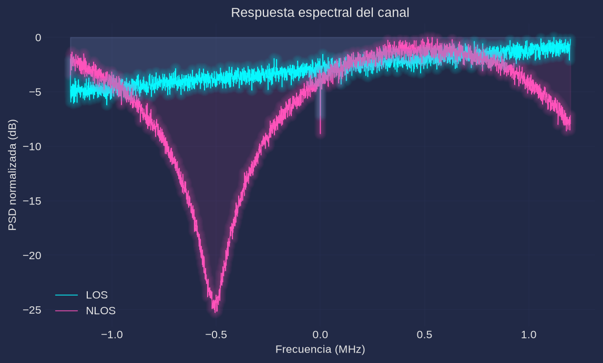
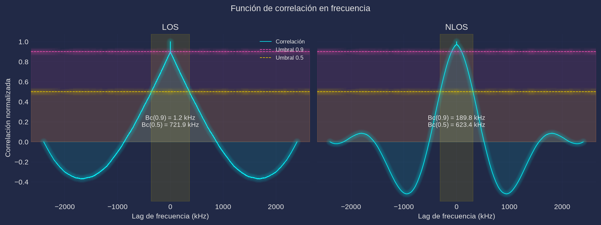

# Práctica 6. Caracterización experimental de canales selectivos en frecuencia

**Materia:** Comunicaciones Inalámbricas
**Equipo:** RTL-SDR (`RTL2832U` + tuner `R820T`), antena; entorno interior con reflectores
**Script:** [`practica6.py`](practica6.py) (Python; en este repo el análisis se hace en Python en lugar de MATLAB)

---

## 1. Objetivo

Caracterizar experimentalmente un canal selectivo en frecuencia en un entorno interior. A partir de capturas IQ en escenarios con línea de vista (LOS) y sin línea de vista (NLOS) se estima la respuesta espectral del canal, su función de correlación en frecuencia y el ancho de banda de coherencia, para relacionar la dispersión temporal producida por la multitrayectoria con la selectividad en frecuencia.

## 2. Fundamento teórico

### 2.1 Respuesta impulsional multitrayectoria

Cuando la señal se propaga por $N$ trayectorias (directa, reflexiones, difracciones), cada una llega con amplitud $a_i$, fase $\varphi_i$ y retardo $\tau_i$. La respuesta impulsional del canal es

$$h(t)=\sum_{i=1}^{N} a_i\,e^{j\varphi_i}\,\delta(t-\tau_i)$$

y la señal recibida es la convolución de la transmitida con $h(t)$ más ruido:

$$y(t)=x(t)*h(t)+n(t)$$

El perfil de retardo de potencia (PDP) es $P(\tau)=|h(\tau)|^2$.

### 2.2 Respuesta en frecuencia

Aplicando la transformada de Fourier,

$$H(f)=\mathcal{F}\{h(t)\}=\sum_{i=1}^{N} a_i\,e^{j\varphi_i}\,e^{-j2\pi f\tau_i} \qquad\Longrightarrow\qquad Y(f)=H(f)\,X(f)+N(f)$$

Para el caso de dos rayos $h(t)=\delta(t)+a\,e^{j\varphi}\delta(t-\tau)$,

$$|H(f)|^2=1+a^2+2a\cos(2\pi f\tau-\varphi),$$

es decir, una respuesta con rizado cosenoidal y nulos (desvanecimientos profundos) cada $\Delta f = 1/\tau$. Si $\tau$ es pequeño, el rizado es lento y el canal es casi plano dentro de la banda observada; si $\tau$ crece, los nulos se acercan y el canal se vuelve selectivo en frecuencia.

### 2.3 RMS delay spread

El retardo medio y el retardo cuadrático medio (RMS delay spread) se definen como

$$\bar{\tau}=\frac{\sum_i P(\tau_i)\,\tau_i}{\sum_i P(\tau_i)}, \qquad
\sigma_\tau=\sqrt{\frac{\sum_i P(\tau_i)\,\tau_i^2}{\sum_i P(\tau_i)}-\bar{\tau}^2}$$

$\sigma_\tau$ cuantifica la dispersión temporal del canal: es la "anchura" del PDP. Para el canal de dos rayos con pesos normalizados $p_i=a_i^2/\sum_k a_k^2$,

$$\sigma_\tau=\tau\sqrt{p_0p_1}.$$

### 2.4 Ancho de banda de coherencia

El ancho de banda de coherencia $B_c$ es el rango de frecuencias sobre el cual la respuesta del canal se mantiene aproximadamente constante (correlacionada). Es inversamente proporcional a $\sigma_\tau$:

$$B_c\approx\frac{1}{5\,\sigma_\tau} \qquad \text{o} \qquad B_c\approx\frac{1}{2\pi\,\sigma_\tau}.$$

Si el ancho de banda de la señal $B_s \ll B_c$ el canal es plano (no selectivo) dentro de la banda de la señal; si $B_s > B_c$ aparecen distorsiones por selectividad en frecuencia. Otra definición experimental, la que se usa en esta práctica, fija $B_c$ como el ancho alrededor de $\Delta f=0$ dentro del cual la función de correlación en frecuencia de la PSD permanece por encima de un umbral (0.9 o 0.5).

## 3. Desarrollo experimental

### 3.1 Configuración del receptor

| Parámetro | Valor |
|---|---|
| Frecuencia central | **433.9 MHz** (banda ISM de 433 MHz) |
| Sample rate | 2.4 MSPS |
| Muestras por captura | 262 144 (≈ 109.2 ms) |
| Resolución de la PSD | $F_s/4096 \approx 585.9$ Hz |
| Estimación de PSD | Welch, ventana Hann, `nperseg=4096`, solapamiento 50 % |
| Ganancia | `auto`: la mayor ganancia que no recorta el ADC |
| Captura | asíncrona (sin pérdida de muestras) |

### 3.2 Escenarios medidos

Se selecciona un entorno interior con abundantes reflectores (pasillo/laboratorio). Para cada escenario se realiza una captura con el mismo receptor y la misma frecuencia central:

- **LOS (línea de vista):** transmisor y receptor enfrentados sin obstáculos entre ambos; domina la trayectoria directa y la dispersión temporal es pequeña.
- **NLOS (sin línea de vista):** se interpone un obstáculo (muro, mobiliario, cambio de pasillo) de modo que la señal llega solo por reflexiones y difracciones; la dispersión temporal aumenta.

En el script, el modo real pide al usuario colocar el receptor en cada escenario y captura con `comun.capturar`:

```python
for esc, desc in (("LOS", "en línea de vista directa"),
                  ("NLOS", "con obstáculos (sin línea de vista)")):
    input(f"[{esc}] Coloca el receptor {desc} y pulsa ENTER para capturar... ")
    capturas[esc] = comun.capturar(args.freq, n=args.n, rate=args.rate,
                                   ganancia=args.gain)
```

### 3.3 Procedimiento de análisis (por escenario)

1. Se estima la PSD por el método de Welch (`nperseg=4096`) y se normaliza a su máximo; se grafica en dB.
2. Se centra la PSD (se resta su media) y se calcula la correlación completa:
   $R=\texttt{correlate}(p-\bar{p},\,p-\bar{p},\,\text{'full'})$, normalizada a coeficiente ($R[0]=1$). El eje de lags se convierte a Hz multiplicando por el espaciado de la PSD, $\Delta f=F_s/4096$.
3. Se reporta $B_c$ como el ancho total de la región contigua alrededor de $\Delta f=0$ donde $R>0.9$ y donde $R>0.5$.
4. Se registran la potencia promedio (dBFS) y la variación espectral (desviación estándar de la PSD en dB).

### 3.4 Modo de verificación `--sim`

Antes de la corrida real, el script incluye un canal sintético de dos rayos $h=[1,\,a\,e^{j\varphi}]$ con retardo $\tau$, aplicado en frecuencia a ruido blanco complejo gaussiano de banda ancha (más ruido aditivo a 25 dB de SNR):

| Escenario | $a$ | $\tau$ | $\varphi$ | $\sigma_\tau$ | $B_c\approx 1/(5\sigma_\tau)$ | $B_c\approx 1/(2\pi\sigma_\tau)$ |
|---|---|---|---|---|---|---|
| LOS | 0.5 | 0.05 µs | fija ($3\pi/4$) | 20 ns | 10.0 MHz | 7.96 MHz |
| NLOS | 0.9 | 0.5 µs | aleatoria | 248.6 ns | 804 kHz | 640 kHz |

El retardo se aplica multiplicando el espectro de la señal por $H(f)$ (y no con una convolución de dos taps) porque $\tau=0.05$ µs es menor que el periodo de muestreo (416.7 ns). El barrido completo también se verifica con `python3 practica6.py --selftest`, que exige $B_c(\text{NLOS})<B_c(\text{LOS})$ con el criterio 0.5 y $B_c^{0.5}(\text{NLOS})\in[100\,\text{kHz},\,2\,\text{MHz}]$.

## 4. Código

El script completo está en [`practica6.py`](practica6.py). Fragmentos esenciales:

```python
# Canal de 2 rayos simulado (retardo sub-muestra aplicado en frecuencia)
H = 1 + a * np.exp(1j * (phi - 2 * np.pi * f * tau))                # H(f)
y = np.fft.ifft(np.fft.fft(x) * H)                                  # y = x * h

# PSD de Welch normalizada (paso 1)
f, P = comun.espectro(x, fs, nperseg=4096)                          # PSD centrada
psd = P / P.max()
psd_db = 10 * np.log10(psd + 1e-20)

# Función de correlación en frecuencia (paso 2)
v = psd - psd.mean()
R = sig.correlate(v, v, "full"); R = R / R.max()                    # R = xcorr(PSD,'coeff')
lags = sig.correlation_lags(v.size, v.size, "full") * (f[1] - f[0])

# Ancho de banda de coherencia (paso 3)
def ancho_coherencia(R, lags, umbral):
    c = R.size // 2
    sobre = R > umbral
    i = j = c
    while i > 0 and sobre[i - 1]: i -= 1
    while j < R.size - 1 and sobre[j + 1]: j += 1
    return float(lags[j] - lags[i])
```

Ejecución:

```bash
python3 practica6.py --selftest        # verificación sin hardware
python3 practica6.py --sim --no-show   # resultados de verificación por simulación
python3 practica6.py                   # corrida real: pide LOS y NLOS por consola
```

## 5. Resultados

> **Los datos y figuras de esta sección provienen de la verificación por simulación (`--sim`, canal de dos rayos con los parámetros de la Tabla 3.4); son datos sintéticos de comprobación del procesamiento y se reemplazan por los de la corrida real en el entorno interior LOS/NLOS.** Como el desfase $\varphi$ del NLOS es aleatorio, los valores pueden variar ligeramente entre ejecuciones.

### 5.1 Tabla de resultados (simulación)

| Escenario | Potencia (dBFS) | Variación espectral (dB) | Bc 0.9 | Bc 0.5 |
|---|---|---|---|---|
| LOS | −2.50 | 1.27 | 1.2 kHz | 710.2 kHz |
| NLOS | 3.12 | 5.95 | 191.0 kHz | 615.2 kHz |

### 5.2 Respuesta espectral (PSD normalizada)



El escenario NLOS presenta un nulo profundo (≈ −25 dB) dentro de la banda analizada (su posición depende de la fase aleatoria $\varphi$ del rayo reflejado) y un rizado cosenoidal con separación entre nulos de ≈ 2 MHz, consistente con $\Delta f=1/\tau=1/0.5\,\mu s$. El escenario LOS es mucho más plano (variación espectral 1.27 dB frente a 5.95 dB), con rizado muy lento porque $\tau=0.05$ µs produce nulos cada 20 MHz, fuera del span observado de 2.4 MHz.

### 5.3 Función de correlación en frecuencia



La correlación es simétrica alrededor de $\Delta f=0$ y decae más rápido en NLOS que en LOS con el criterio 0.5: $B_c^{0.5}(\text{NLOS})=615.2$ kHz $< B_c^{0.5}(\text{LOS})=710.2$ kHz. Con el criterio 0.9 la estimación es mucho más estrecha (1.2 kHz en LOS y 191.0 kHz en NLOS), porque el umbral alto es muy sensible al rizado residual del estimador de PSD. El valor medido en NLOS (615.2 kHz) es cercano a la predicción $1/(2\pi\sigma_\tau)=640$ kHz de la Tabla 3.4.

## 6. Análisis de resultados

### 6.1 ¿El canal afecta todas las frecuencias por igual?

No. En el escenario NLOS la PSD cae ≈ 25 dB en el nulo y presenta máximos y mínimos alternados: distintas componentes espectrales experimentan ganancias muy distintas, que es la definición de canal selectivo en frecuencia. En LOS la respuesta es casi plana dentro de los 2.4 MHz analizados (variación espectral de solo 1.27 dB), por lo que el canal es aproximadamente no selectivo a esa escala de ancho de banda.

### 6.2 Diferencias entre LOS y NLOS

En NLOS la señal solo llega por trayectorias reflejadas/difractadas, con mayor diferencia de retardos; el RMS delay spread es mayor y por tanto el ancho de banda de coherencia es menor, apareciendo nulos profundos y rizado rápido en la PSD. En LOS domina la trayectoria directa: el exceso de retardo es pequeño, el rizado es lento (fuera de la banda observada) y la PSD es notablemente más plana. La corrida simulada reproduce esta tendencia ($B_c^{0.5}$ menor en NLOS); en una medición real la diferencia suele ser aún mayor porque las reflexiones tienen amplitudes y retardos distribuidos de forma continua y no en dos rayos discretos.

### 6.3 Relación entre multitrayectoria y selectividad en frecuencia

La selectividad en frecuencia es el efecto en el dominio frecuencial de la dispersión temporal: $H(f)$ es la transformada de $h(t)$. Cuanto mayor es la separación entre las réplicas (mayor $\sigma_\tau$), más rápido varía $H(f)$ con la frecuencia y más estrecho es $B_c=1/(2\pi\sigma_\tau)$ aproximadamente. Si $B_s>B_c$, la señal ocupa varias "lóbulos" del canal y sufre distorsión; si $B_s\ll B_c$, todas sus componentes ven la misma ganancia compleja (canal plano).

También conviene notar que un $B_c$ pequeño implica que el canal cambia de forma importante en intervalos cortos de frecuencia: la ecualización se complica y el rendimiento de esquemas de portadora única de banda ancha se degrada por interferencia entre símbolos.

### 6.4 Limitación del método con señales no blancas

El método supone que la PSD medida refleja la respuesta del canal, es decir, que la señal transmitida tiene espectro plano (blanca) en la banda analizada. Si la señal es no blanca (una emisora FM/ASK con espectro concentrado, un tono, o simplemente ruido del receptor durante los silencios), la PSD medida es $|H(f)|^2|X(f)|^2+N(f)$ y la forma de $|X(f)|^2$ contamina la correlación, sesgando $B_c$. En la corrida real a 433.9 MHz esto es crítico porque debe existir un transmisor de banda ancha activo en la banda; en la simulación se evita por construcción al usar ruido blanco. Además, el estimador de Welch introduce rizado estadístico que limita la resolución de $B_c$, sobre todo con el umbral 0.9.

## 7. Cuestionario

1. **¿Qué es un canal selectivo en frecuencia?**
   Es un canal cuya respuesta en frecuencia $H(f)$ no es constante dentro de la banda de la señal: distintas componentes espectrales sufren ganancias y fases diferentes. Se debe a la multitrayectoria (dispersión temporal) y ocurre cuando el ancho de banda de la señal es mayor que el ancho de banda de coherencia del canal ($B_s>B_c$).

2. **¿Qué es el RMS delay spread?**
   Es la desviación estándar de los retardos del perfil de potencia del canal, $\sigma_\tau=\sqrt{\overline{\tau^2}-\bar{\tau}^2}$. Mide cuánto se dispersa temporalmente la energía (cuánto se "alargan" los pulsos) y es la causa directa de la selectividad en frecuencia: cuanto mayor es $\sigma_\tau$, menor es $B_c$ y más rápido varía $H(f)$.

3. **¿Qué es el ancho de banda de coherencia?**
   Es el rango de frecuencias dentro del cual la respuesta del canal se mantiene aproximadamente constante (correlacionada). En términos prácticos es el máximo ancho de banda que una señal puede ocupar sin sufrir distorsión apreciable, y se estima como $B_c\approx 1/(5\sigma_\tau)$ o $1/(2\pi\sigma_\tau)$; en esta práctica se mide experimentalmente como el ancho de la región central donde la correlación de la PSD supera 0.9 o 0.5.

4. **¿Cómo afecta la multitrayectoria a señales de banda ancha?**
   Genera réplicas atenuadas y retardadas que se superponen. En el tiempo, si la duración del símbolo es comparable o menor que $\sigma_\tau$, aparece interferencia entre símbolos (ISI); en frecuencia, produce desvanecimientos selectivos (nulos) que distorsionan el espectro. El efecto crece con el ancho de banda de la señal, por lo que limita la velocidad de transmisión de esquemas de portadora única sin ecualización.

5. **¿Por qué OFDM es adecuado para estos canales?**
   Porque divide la banda ancha en muchas subportadoras estrechas, cada una con $B_{\text{sub}}\ll B_c$, de modo que cada subportadora ve un canal aproximadamente plano y se puede ecualizar con un solo coeficiente complejo (una multiplicación), sin ecualizadores largos. Además, el prefijo cíclico (más largo que $\sigma_\tau$) convierte la convolución con el canal en una convolución circular, eliminando la ISI entre símbolos OFDM.

## 8. Conclusiones

Se implementó un analizador de canales selectivos en frecuencia sobre el receptor RTL-SDR: captura IQ en escenarios LOS/NLOS, PSD de Welch normalizada, correlación de la PSD centrada y estimación de $B_c$ con umbrales 0.9 y 0.5, además de un modo simulado de dos rayos y un autotest. En la verificación por simulación el canal NLOS ($\tau=0.5$ µs, $\sigma_\tau=248.6$ ns) mostró un nulo profundo y rizado rápido con $B_c^{0.5}=615.2$ kHz, cercano al valor teórico $1/(2\pi\sigma_\tau)=640$ kHz, mientras que el canal LOS ($\tau=0.05$ µs) resultó casi plano ($B_c^{0.5}=710.2$ kHz, con variación espectral de solo 1.27 dB frente a 5.95 dB en NLOS). El autotest (`practica6.py --selftest`) verifica que $B_c(\text{NLOS})<B_c(\text{LOS})$ y que $B_c^{0.5}(\text{NLOS})$ cae en el rango esperado. El método es válido siempre que la señal analizada sea de banda ancha y aproximadamente blanca; con señales no blancas o con poco promediado la estimación de $B_c$ se sesga y debe interpretarse con cautela. Los resultados definitivos se obtienen ejecutando la corrida real LOS/NLOS en el entorno interior.
