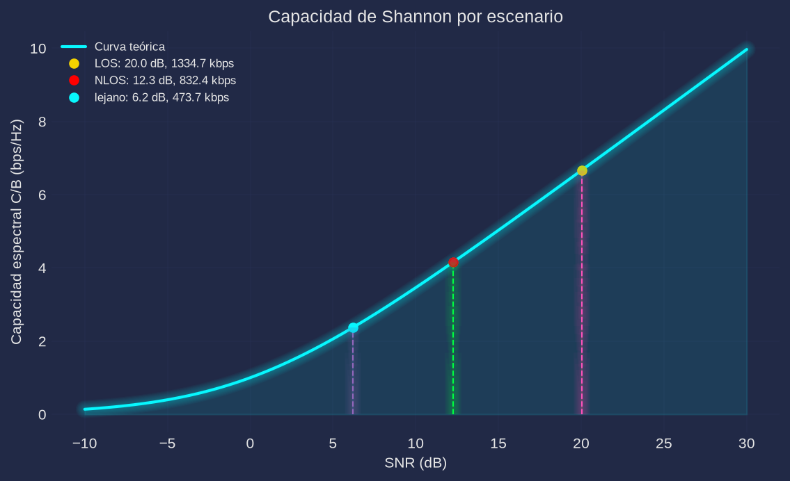
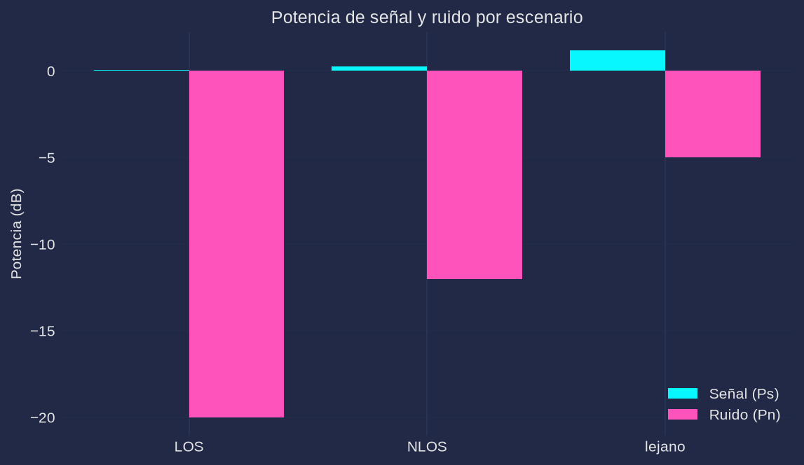

# Práctica 7. Estimación experimental de la capacidad de canal

**Materia:** Comunicaciones Inalámbricas
**Equipo:** RTL-SDR (`RTL2832U` + tuner `R820T`), antena telescópica, fuente transmisora continua en 433.9 MHz
**Script:** [`practica7.py`](practica7.py) (Python; en este repo el análisis se hace en Python en lugar de MATLAB)

---

## 1. Objetivo

Estimar experimentalmente la capacidad de un canal inalámbrico a partir de mediciones reales del receptor RTL-SDR: medir la potencia de señal $P_s$ y de ruido $P_n$, estimar la relación señal a ruido (SNR) y calcular la capacidad de Shannon $C = B\log_2(1+\mathrm{SNR})$ para tres escenarios de propagación (línea de vista, interior con obstáculos y distancia máxima), comparando cada punto experimental contra la curva teórica.

## 2. Fundamento teórico

El teorema de Shannon-Hartley establece la máxima tasa de transmisión libre de errores (capacidad) de un canal AWGN de ancho de banda $B$:

$$C = B\,\log_2\!\left(1+\frac{P_s}{P_n}\right) = B\,\log_2(1+\mathrm{SNR}) \quad \text{[bps]}$$

La eficiencia espectral $C/B$ (bps/Hz) depende sólo de la SNR lineal; en dB, $\mathrm{SNR_{dB}} = 10\log_{10}(P_s/P_n)$. Cuando $\mathrm{SNR}\ll 1$ la capacidad decrece hacia cero, y para $\mathrm{SNR}\gg 1$ crece logarítmicamente (cada 3 dB de SNR añaden ≈1 bps/Hz).

La potencia promedio recibida se estima sobre $N$ muestras IQ como

$$P_s = \frac{1}{N}\sum_{n=0}^{N-1}|x[n]|^2, \qquad P_{s,\mathrm{dB}} = 10\log_{10}(P_s)$$

Para el ruido se captura una frecuencia cercana donde no exista transmisión y se aplica la misma estimación:

$$P_n = \frac{1}{N}\sum_{n=0}^{N-1}|n[k]|^2, \qquad \mathrm{SNR} = \frac{P_s}{P_n}$$

Nota: como la captura de señal ya contiene ruido, $\mathrm{SNR} = (S+N)/N$; la sobreestimación es de $10\log_{10}(1+1/\mathrm{SNR_{real}})$ dB, despreciable cuando la SNR es alta (0.04 dB a 20 dB) y de ≈1.2 dB en el peor caso medido (5 dB).

## 3. Desarrollo experimental

### 3.1 Configuración del receptor

| Parámetro | Valor |
|---|---|
| Frecuencia central | 433.9 MHz (banda ISM de la fuente transmisora) |
| Canal de ruido | 434.9 MHz ($f + 1$ MHz, sin transmisión) |
| Sample rate | 2.4 MHz |
| Muestras por captura | 262 144 (≈109 ms) |
| Ancho de banda de referencia | $B = 200$ kHz |
| Filtro IF del tuner | 2.4 MHz (span completo) |
| Ganancia | fija calibrada ("auto": la mayor sin recorte del ADC) |

### 3.2 Escenarios

1. **LOS:** transmisor y receptor con línea de vista directa, sin obstáculos.
2. **NLOS (interior con obstáculos):** enlace atravesando muros/mobiliario; se esperan pérdidas por penetración y multitrayectoria.
3. **Lejano (distancia máxima):** receptor en el límite del área de medición; domina la pérdida por trayectoria y el nivel de señal cae hacia el piso de ruido.

### 3.3 Medición del ruido en un canal vacío

Para cada escenario se realizan dos capturas con la misma configuración del receptor: la señal en $f=433.9$ MHz y el ruido en $f + \Delta f = 434.9$ MHz, verificando antes (con el espectro) que esa frecuencia cercana esté libre de transmisiones. Al provenir de la misma ganancia y del mismo instante de propagación, $P_n$ incluye el ruido térmico y el piso propio del receptor, y la diferencia de 1 MHz es mucho mayor que el ancho de banda de 200 kHz analizado, por lo que el ruido medido es un estimador válido del ruido que acompaña a la señal. En modo `--sim` se replica el mismo procedimiento de dos capturas: una con señal BPSK + ruido y otra de sólo ruido.

### 3.4 Procedimiento

1. `python3 practica7.py` solicita confirmación (`input()`) antes de cada escenario y captura señal y ruido con `comun.capturar` (lectura asíncrona, sin perder muestras).
2. Se calculan $P_s$, $P_n$, la SNR y $C = B\log_2(1+\mathrm{SNR})$.
3. Se grafican la curva de Shannon con los puntos experimentales (`figs/shannon.png`) y las potencias por escenario (`figs/potencias.png`).
4. Se guardan los resultados en `datos/resultados.json`.
5. `python3 practica7.py --sim --no-show` ejecuta el mismo pipeline sin dongle para verificación; `--selftest` comprueba el estimador de SNR.

## 4. Código

El script completo está en [`practica7.py`](practica7.py). Fragmentos esenciales:

```python
# captura real: senal y ruido en canal cercano vacio
x  = comun.capturar(args.freq, n=args.n, rate=args.rate, ganancia=args.gain)
xr = comun.capturar(args.freq + args.fnoise, n=args.n, rate=args.rate, ganancia=args.gain)

Ps  = np.mean(np.abs(x) ** 2)                 # Ps = mean(abs(data).^2)
Pn  = np.mean(np.abs(xr) ** 2)                # Pn = mean(abs(dataNoise).^2)
SNR = Ps / Pn                                 # SNR = Ps/Pn
C   = B * np.log2(1 + SNR)                    # C = B*log2(1+SNR)

snr_db = np.linspace(-10, 30, 401)            # curva teorica
ax.plot(snr_db, np.log2(1 + 10 ** (snr_db / 10)))   # C/B en bps/Hz vs SNR (dB)
```

La simulación (`captura_sim`) genera símbolos BPSK de potencia unitaria más ruido complejo gaussiano con la SNR conocida de cada escenario (LOS 20 dB, NLOS 12 dB, lejano 5 dB) y una captura independiente de sólo ruido.

## 5. Resultados

> **NOTA: los datos de esta sección son datos de verificación por simulación (`--sim`), no una corrida real con el dongle. Se presentan para validar el pipeline y se reemplazan con la corrida real (`python3 practica7.py`) al medir en campo.**

| Escenario | Potencia señal (dB) | Potencia ruido (dB) | SNR (dB) | Capacidad (kbps) |
|---|---|---|---|---|
| LOS | 0.04 | -20.00 | 20.05 | 1334.71 |
| NLOS | 0.26 | -12.02 | 12.28 | 832.37 |
| lejano | 1.19 | -5.00 | 6.20 | 473.72 |

Capacidad en Mbps: **LOS = 1.335 Mbps**, **NLOS = 0.832 Mbps**, **lejano = 0.474 Mbps** ($B = 200$ kHz).

### 5.1 Curva de Shannon



La curva teórica $C/B=\log_2(1+\mathrm{SNR})$ se grafica de $-10$ a $30$ dB. Cada escenario experimental se marca con su línea vertical y su punto sobre la curva: LOS (20.05 dB, 6.67 bps/Hz), NLOS (12.28 dB, 4.16 bps/Hz) y lejano (6.20 dB, 2.37 bps/Hz). Los tres puntos caen sobre la curva, lo que valida el estimador.

### 5.2 Potencias de señal y ruido



$P_n$ es prácticamente constante entre escenarios (el ruido del receptor no depende de la posición de la antena, en simulación es el mismo por diseño), mientras $P_s$ cae con los obstáculos y la distancia; toda la variación de la capacidad proviene por tanto de la SNR.

## 6. Análisis

- **Efecto de la distancia:** la potencia recibida cae con la pérdida por trayectoria (en espacio libre $\propto d^{-2}$, en interiores con exponentes mayores por obstáculos). Al reducirse $P_s$ con $P_n$ fijo, la SNR baja en dB y la capacidad cae de forma logarítmica: los 14 dB de diferencia entre LOS y lejano reducen la capacidad de 1.335 a 0.474 Mbps (≈ 65 %).
- **Efecto de los obstáculos:** el escenario NLOS pierde ≈8 dB respecto a LOS por penetración en muros y por multitrayectoria. Esa caída se traduce en 503 kbps menos de capacidad (1.335 → 0.832 Mbps), consistente con el shadowing y el fading descritos en las prácticas de propagación.
- **Relación con las prácticas de fading:** el desvanecimiento hace que la SNR instantánea (y por tanto la capacidad) sea una variable aleatoria. Las mediciones puntuales de esta práctica son "instantáneas" de un canal que en las prácticas de fading se caracteriza por su distribución (Rayleigh/Rician) y su margen; un sistema real debe dimensionarse para una SNR de outage, no para la SNR media, por lo que la capacidad sostenible es menor que la calculada con el valor medio.
- **Si se duplica el ancho de banda ($B = 400$ kHz):** para la misma SNR, $C$ se duplica (LOS pasaría de 1.335 a 2.669 Mbps). En la gráfica $C/B$ vs SNR el punto no cambia (es la misma eficiencia espectral), pero la capacidad absoluta aumenta proporcionalmente a $B$. En la práctica el doble de ancho de banda también capta el doble de ruido ($P_n = N_0 B$), de modo que si la señal no ocupa ese ancho extra la ganancia se degrada; si la señal también duplica su banda, la mejora es real.

## 7. Cuestionario

1. **¿Qué representa la capacidad de Shannon?**
   La máxima tasa de información (bits/s) que puede transmitirse por un canal con una probabilidad de error tan pequeña como se quiera, dado su ancho de banda y su SNR. Es una cota superior teórica alcanzable con codificación y modulación óptimas, no una tasa garantizada por un esquema concreto.
2. **¿Por qué la capacidad aumenta con la SNR?**
   Porque una mayor potencia de señal frente al ruido permite distinguir más niveles de la constelación y, con codificación canal, hace posible usar más bits por símbolo con error despreciable. El crecimiento es logarítmico: cada vez se necesitan más dB para ganar otro bps/Hz (≈3 dB por bps/Hz a SNR alta).
3. **¿Qué ocurre cuando la SNR es muy baja?**
   $C/B \approx \mathrm{SNR}/\ln 2$ (lineal en SNR): la capacidad cae hacia cero, aunque nunca es exactamente cero para $B>0$. Se requiere mucha codificación y tiempos de símbolo largos; en el límite, por debajo del umbral de Shannon la comunicación fiable exige anchos de banda enormes.
4. **¿Qué factores del canal afectan la capacidad?**
   La SNR (potencia transmitida, ganancia de antenas, distancia, obstáculos, interferencia y ruido del receptor), el ancho de banda disponible, el ruido $N_0$, el fading multitrayectoria, el shadowing, la movilidad (Doppler) y la presencia de interferencias o canales ocupados.
5. **¿Por qué la capacidad real de un sistema suele ser menor que la teórica?**
   Porque Shannon supone canal AWGN, símbolos y códigos infinitamente largos y decodificación óptima; los sistemas reales tienen modulación/codificación finitas, errores de estimación de canal, interferencia, fading y transitorios, además de que parte del ancho de banda se pierde en bandas de guarda, prefijos cíclicos y pilotos. Por eso se usan "brechas" (coding gap) de varios dB respecto a la curva de Shannon.

## 8. Conclusiones

Se implementó un estimador experimental de capacidad de canal basado en $P_s = \mathrm{mean}(|x|^2)$ y $P_n$ medido en un canal vacío cercano. El procedimiento se validó por simulación con SNR conocidas (LOS 20 dB → 1.335 Mbps, NLOS 12 dB → 0.832 Mbps, lejano 5 dB → 0.474 Mbps) y con `--selftest` (estimación de una SNR de 15 dB con error < 1.5 dB). Los resultados confirman la dependencia logarítmica de la capacidad con la SNR y muestran que la distancia y los obstáculos reducen la SNR y, con ella, la capacidad del enlace; la curva de Shannon permite cuantificar ese efecto y sirve de cota para el diseño del sistema. **Los valores presentados son de verificación por simulación y deben reemplazarse con la corrida real**, que es reproducible con `python3 practica7.py` y verificable sin hardware con `python3 practica7.py --sim --no-show`.
